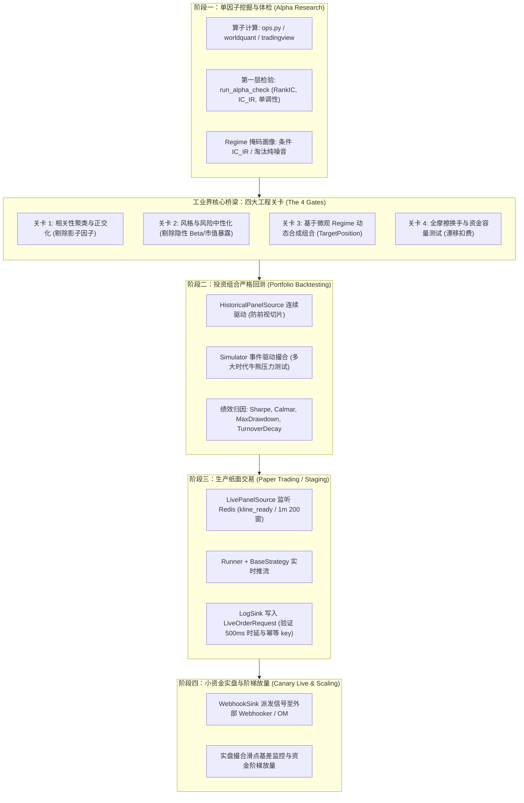

# 从单因子研究到实盘生产：量化策略全生命周期与模块归属准则

> 本文档为 Sherpa 量化系统的**顶层工程准则（Master Engineering Guideline）**，系统性规范从单因子挖掘、跨越四大工程关卡、构建投资组合，直至历史回测、纸面交易与实盘放量的完整全生命周期。
> 
> 本文档清晰定义了每一个生命周期阶段**在代码库中的模块归属**以及**对应的 Research 专题研究文档与实战工程索引**，作为后续量化研发与文档演进的统一总纲。

---

## 目录
1. [全生命周期总览图与架构划分](#1-全生命周期总览图与架构划分)
2. [全生命周期文档与工程索引全景表](#2-全生命周期文档与工程索引全景表)
3. [阶段一：单因子挖掘与体检 (Alpha Research)](#3-阶段一单因子挖掘与体检-alpha-research)
   - [3.1 职责边界与准入准出](#31-职责边界与准入准出)
   - [3.2 对应 Research 文档与实操指南](#32-对应-research-文档与实操指南)
   - [3.3 对应代码模块归属](#33-对应代码模块归属)
4. [桥梁关卡：从单因子到投资组合的四大核心门槛 (The 4 Gates)](#4-桥梁关卡从单因子到投资组合的四大核心门槛-the-4-gates)
   - [关卡 1：因子相关性分析与正交化 (Orthogonalization)](#关卡-1因子相关性分析与正交化-orthogonalization)
   - [关卡 2：风险与风格中性化 (Risk & Style Neutralization)](#关卡-2风险与风格中性化-risk--style-neutralization)
   - [关卡 3：基于微观 Regime 的动态多因子合成 (Synthesis)](#关卡-3基于-微观-regime-的动态多因子合成-synthesis)
   - [关卡 4：第二层可变现性与资金容量压力测试 (Friction Test)](#关卡-4第二层可变现性与资金容量压力测试-friction-test)
   - [关卡对应指导文档与设计原理](#关卡对应指导文档与设计原理)
5. [阶段二：投资组合严格时序回测 (Portfolio Backtesting)](#5-阶段二投资组合严格时序回测-portfolio-backtesting)
   - [5.1 职责边界与核心规范](#51-职责边界与核心规范)
   - [5.2 对应指导文档与示例工程](#52-对应指导文档与示例工程)
   - [5.3 对应代码模块归属](#53-对应代码模块归属)
6. [阶段三：生产环境纸面交易 (Paper Trading / Staging)](#6-阶段三生产环境纸面交易-paper-trading--staging)
   - [6.1 职责边界与验收指标](#61-职责边界与验收指标)
   - [6.2 对应指导文档与示例工程](#62-对应指导文档与示例工程)
   - [6.3 对应代码模块归属](#63-对应代码模块归属)
7. [阶段四：小资金实盘与阶梯放量 (Canary Live & Scaling)](#7-阶段四小资金实盘与阶梯放量-canary-live--scaling)
   - [7.1 职责边界与风控规范](#71-职责边界与风控规范)
   - [7.2 对应代码模块与外部系统边界](#72-对应代码模块与外部系统边界)
8. [Sherpa 底层代码模块调用关系矩阵](#8-sherpa-底层代码模块调用关系矩阵)

---

## 1. 全生命周期总览图与架构划分

在工业级量化体系中，**“单因子（Alpha）”绝不等于“策略（Strategy）”**。从数学信息到账户资金的稳健增长，必须跨越一条完整的生产流水线：

---

## 2. 全生命周期文档与工程索引全景表

为了让读者清晰掌握当前代码库中各个文档所处的研究阶段与具体作用，下表给出了全局映射全景图：

| 生命周期阶段 | 核心任务目标 | 关联 Research 文档 / 系统指南 | 文档核心作用与解决的痛点 |
| :--- | :--- | :--- | :--- |
| **阶段一：单因子挖掘与体检 *(Alpha Research)*** | 因子数学表达、全时序计算、无前视因果打标、环境适应性体检、指标数值量级标尺与品性诊断 | 📘 [`docs/ALPHA_METRIC_BENCHMARKS.md`](file:///d:/code-repo/Chomo/Sherpa/docs/ALPHA_METRIC_BENCHMARKS.md)  📘 [`research/REGIME_FRAMEWORK_GUIDE.md`](file:///d:/code-repo/Chomo/Sherpa/research/REGIME_FRAMEWORK_GUIDE.md)  📘 [`research/REGIME_ALPHA_EVALUATION_WORKFLOW.md`](file:///d:/code-repo/Chomo/Sherpa/research/REGIME_ALPHA_EVALUATION_WORKFLOW.md)  🛠️ [`research/alpha_research/worldquant_101/`](file:///d:/code-repo/Chomo/Sherpa/research/alpha_research/worldquant_101) | **体检指标体系与量级基准**：规范 `ic_mean`、`ic_std`、`ic_ir`、`win_rate`、`samples`、`ic_ir_gap` 的数学物理本质与工业级及格/优秀/神级量级标尺，给出多指标交叉诊断口诀。  **市场状态分类准则**：建立 TradFi 四大维度到 Crypto 的 1:1 映射，补充永续合约特有的资金费率与杠杆维度，给出 BTC 减半宏观情景切片与 Python 代码。  **工业级单因子测评 SOP**：阐述“全时序连续计算、严格 Point-in-time 条件掩码打标”机制，剖析物理切片四大暗礁，输出因子决策矩阵。  **首个落地研究项目**：基于真实 ClickHouse 全量 4h 数据，完成世坤 101 因子的批量筛选与排行榜产出。 |
| **四大桥梁关卡 *(Portfolio Construction)*** | 因子去冗余正交化、风格剥离、基于微观 Regime 动态组装组合大脑 | 📘 [`docs/backtest_principle.md`](file:///d:/code-repo/Chomo/Sherpa/docs/backtest_principle.md)  🔖 *(预留规划中文档)* | **回测两层第一性原理**：系统性阐明信息预测力（第一层）与资金可变现性（第二层）的鸿沟，推导因果律 Shift-1、去均值 L1 归一化与被动持仓漂移公式。  *(后续将补充: 因子正交化实操、Regime 路由动态加权指南)* |
| **阶段二：投资组合回测 *(Portfolio Backtesting)*** | 宏观多时代切片压力测试、事件驱动逐 Bar 撮合、综合净值与风控归因 | 📘 [`docs/backtest_principle.md`](file:///d:/code-repo/Chomo/Sherpa/docs/backtest_principle.md)  💻 [`examples/vectorized_research.py`](file:///d:/code-repo/Chomo/Sherpa/examples/vectorized_research.py)  💻 [`examples/runner_backtest_with_stop_loss.py`](file:///d:/code-repo/Chomo/Sherpa/examples/runner_backtest_with_stop_loss.py) | **回测第二层原理落地**：严格扣除摩擦、滑点与换手衰减。  **向量化回测范例**：极速验证组合逻辑。  **事件驱动回测范例**：基于 `Runner` + `Simulator` 运行跨 Bar 状态止损策略。 |
| **阶段三：生产纸面交易 *(Paper Trading)*** | 监听真实 Redis 1m 截面通知、验证 500ms 时延预算与幂等 key 稳定性 | 📘 [`sherpa/data/DATA_STRUCTURES_AND_TRANSFORMS.md`](file:///d:/code-repo/Chomo/Sherpa/sherpa/data/DATA_STRUCTURES_AND_TRANSFORMS.md)  💻 [`examples/paper_trading_log_sink.py`](file:///d:/code-repo/Chomo/Sherpa/examples/paper_trading_log_sink.py) | **数据契约与流式规范**：阐明长表转 `BarPanel`、1m `WindowCache` 滑窗与 `MarketEvent` 信封机制。  **纸面交易标准示范**：运行 `LivePanelSource`，通过 `LogSink` 实时打印标准化的 `LiveOrderRequest`。 |
| **阶段四：小资金实盘 *(Live Execution)*** | 派发信号至外部 Webhooker、监控真实撮合滑点、阶梯扩充资金容量 | 📘 [`docs/SHERPA_DESIGN.md`](file:///d:/code-repo/Chomo/Sherpa/docs/SHERPA_DESIGN.md)  🔖 *(预留规划中文档)* | **架构边界定义**：Sherpa 止步于 `WebhookSink` 生成标准化信号意图，明确下游 Webhooker 撮合与 PMS 资金清算边界。  *(后续将补充: 实盘滑点基差监控与订单执行算法 SOP)* |

---

## 3. 阶段一：单因子挖掘与体检 (Alpha Research)

### 3.1 职责边界与准入准出
* **职责边界**：纯数学与统计信息层面的假说检验。评估单个因子在微观层面是否具有超额预测力，并出具其在不同市场气候下的环境适应性体检表。**本阶段严禁构建实际交易持仓，严禁在此阶段计算夏普比率或 PnL**。
* **准入**：全量连续的 [`BarPanel`](file:///d:/code-repo/Chomo/Sherpa/sherpa/data/schema.py#L57-L138) 数据（通常为 3~5 年完整历史）。
* **准出标准**：
  * 淘汰全局无条件 $\text{IC\_IR} < 0.10$ 的纯噪音因子；
  * 输出每个因子在各微观 Regime 掩码下的条件体检矩阵（识别出哪些是全天候因子、哪些是需条件激活动态门控因子）。

### 3.2 对应 Research 文档与实操指南
读者在进行本阶段研发时，应严格遵循以下四篇核心文档：
1. **体检指标体系与经验基准**：[`docs/ALPHA_METRIC_BENCHMARKS.md`](file:///d:/code-repo/Chomo/Sherpa/docs/ALPHA_METRIC_BENCHMARKS.md)
   * **作用**：因子体检的“度量衡手册”。详述 `ic_mean`、`ic_std`、`ic_ir`、`win_rate`、`samples`、`baseline_ic_ir`、`ic_ir_gap` 的数学与物理本质，给出美股日频与加密 4h 的及格/优质/神级经验数值区间，并提供多指标交叉诊断决策树与实操避坑口诀。
2. **理论底座**：[`research/REGIME_FRAMEWORK_GUIDE.md`](file:///d:/code-repo/Chomo/Sherpa/research/REGIME_FRAMEWORK_GUIDE.md)
   * **作用**：指导读者如何用科学客观的指标对市场状态进行分类。详细给出了传统金融四大维度（趋势、波动率、离散度、流动性）到加密资产的 1:1 观测指标映射，追加了加密永续合约专属的“资金费率与杠杆率”维度，并提供了在 Sherpa 中开箱即用的 Python 计算函数。
3. **测评工作流 SOP**：[`research/REGIME_ALPHA_EVALUATION_WORKFLOW.md`](file:///d:/code-repo/Chomo/Sherpa/research/REGIME_ALPHA_EVALUATION_WORKFLOW.md)
   * **作用**：指导读者如何科学执行测评。阐明为什么绝不能物理切断数据（分析了冷启动缺失、后视镜前视泄露、状态切换盲区、小样本拟合四大暗礁），确立了“全时序连续计算 + 严格 Point-in-time 条件掩码打标”的工业级规范，并给出了决策分类矩阵。
4. **实战工程项目**：[`research/alpha_research/worldquant_101/`](file:///d:/code-repo/Chomo/Sherpa/research/alpha_research/worldquant_101)
   * **作用**：世坤 101 因子库在真实 ClickHouse 4h 数据上的筛选实战。包含取数脚本 `data.py`、批量筛选脚本 `run_screening.py` 以及各分类因子的执行模块。

### 3.3 对应代码模块归属
* **算子与因子表达**：[`sherpa.alpha`](file:///d:/code-repo/Chomo/Sherpa/sherpa/alpha/base.py)（`Alpha`、`ops.py`、`worldquant/`、`tradingview/`、`custom/`）。
* **特征组织容器**：[`sherpa.alpha.engine.AlphaEngine`](file:///d:/code-repo/Chomo/Sherpa/sherpa/alpha/engine.py#L14-L41)（管理因子集合，输出特征矩阵）。
* **统计评测库**：[`sherpa.metrics.factor`](file:///d:/code-repo/Chomo/Sherpa/sherpa/metrics/factor.py)（`rank_ic`、`ic_summary`、`quantile_returns`、`is_monotonic_decreasing`）。

---

## 4. 桥梁关卡：从单因子到投资组合的四大核心门槛 (The 4 Gates)

单因子通过了阶段一的体检后，**绝不能直接作为独立策略实盘**。必须经过以下四个严苛关卡，将其组装成抗周期的投资组合：

### 关卡 1：因子相关性分析与正交化 (Orthogonalization)
* **核心痛点**：若选出 8 个在趋势市表现优秀的动量因子，其相关系数可能高达 $0.85 \sim 0.95$。同时押注它们不仅没有增量信息，反而会成倍放大特定方向的尾部风险。
* **处理规范**：
  1. 计算候选因子之间的 Spearman 秩相关矩阵；
  2. 进行层次聚类（Hierarchical Clustering）或施密特正交化（Gram-Schmidt）；
  3. 每个高度相关的簇（Cluster）中，**仅保留信噪比最高或逻辑最简洁的一个因子**，确保进入组合的因子相互正交、彼此互补。
* **对应 Sherpa 模块归属**：`research/` 专项聚类脚本 + [`sherpa.metrics.factor`](file:///d:/code-repo/Chomo/Sherpa/sherpa/metrics/factor.py)。

### 关卡 2：风险与风格中性化 (Risk & Style Neutralization)
* **核心痛点**：许多虚假的“神级因子”本质上只是被动承担了系统性风险（如持续做多高 Beta 山寨币、做空低 Beta 稳健币）。一旦大盘转熊，策略将遭受断崖式亏损。
* **处理规范**：
  1. **截面资金中性（Dollar Neutral）**：多空总敞口严格对冲（$\sum w_i = 0$）；
  2. **风格因子剥离**：通过截面多重回归，剔除因子中对全市场成交额（Size）、BTC 走势（Beta）的被动暴露，保留残差所代表的**纯净选币能力（Pure Alpha）**。
* **对应 Sherpa 模块归属**：[`sherpa.portfolio.weighting`](file:///d:/code-repo/Chomo/Sherpa/sherpa/portfolio/weighting.py)（`demean_l1`、`top_k_long_short` 等）。

### 关卡 3：基于微观 Regime 的动态多因子合成 (Synthesis)
* **核心痛点**：因子在不同宏观/微观环境下各有利弊。如何让策略在正确的时机调用正确的因子？
* **处理规范**：
  1. **构建组合大脑**：在策略层的 [`on_bar`](file:///d:/code-repo/Chomo/Sherpa/sherpa/strategy/base.py#L27-L29) 中，读取当期 Point-in-time 的 Regime 状态标签；
  2. **动态路由与权重分配**：
     * 强趋势/高离散时，提高动量与突破因子的权重分配；
     * 窄幅震荡/低波时，切换至成交量均值回归因子；
  3. **平滑过渡约束**：引入权重变化缓冲（Hysteresis Buffer），严禁在相邻两期进行“非 0 即 100%”的极端剧烈翻转。
* **对应 Sherpa 模块归属**：[`sherpa.strategy.base.BaseStrategy`](file:///d:/code-repo/Chomo/Sherpa/sherpa/strategy/base.py#L16-L30)（编写业务组合逻辑）+ [`sherpa.portfolio.weighting`](file:///d:/code-repo/Chomo/Sherpa/sherpa/portfolio/weighting.py)。

### 关卡 4：第二层可变现性与资金容量压力测试 (Friction Test)
* **核心痛点**：第一层理论收益极高的多因子组合，往往因为极高的换手率，在真实扣除手续费和滑点后净值完全磨平。
* **处理规范**：
  1. **被动持仓漂移追踪**：准确计算持有期内因各资产涨跌导致的权重偏移 $W^{\text{drift}}$，得出真实物理换手率；
  2. **摩擦压力测试**：分别注入 `ZeroCostModel`（测毛利）与 `FixedFeeCostModel(fee_bps=5, slippage_bps=3)`（测净利）；
  3. **指标验收红线**：扣费后净 Sharpe $\ge 2.5$，换手衰减率（Turnover Decay）$< 40\%$。
* **对应 Sherpa 模块归属**：[`sherpa.backtest.cost_model`](file:///d:/code-repo/Chomo/Sherpa/sherpa/backtest/cost_model.py) + [`sherpa.portfolio.turnover`](file:///d:/code-repo/Chomo/Sherpa/sherpa/portfolio/turnover.py)（`drift_weights`、`turnover`）。

### 关卡对应指导文档与设计原理
* **核心指导文档**：[`docs/backtest_principle.md`](file:///d:/code-repo/Chomo/Sherpa/docs/backtest_principle.md)
  * **作用**：详细推导了从“数学预测力”跨越到“资金约束与物理摩擦”的第一性原理，规范了因果律时钟对齐、截面去均值 + L1 归一化公式、真实换手率定义与换手衰减率计算法则。
* *(注：后续关卡成熟后，将在 `research/` 目录下追加《多因子正交化实战指南》与《Regime 组合路由优化指南》)*。

---

## 5. 阶段二：投资组合严格时序回测 (Portfolio Backtesting)

### 5.1 职责边界与核心规范
* **职责边界**：将四大关卡打磨完成的组合策略注入真实的因果律时序驱动器中，考核其跨越多年历史、历经多种宏观牛熊周期（BTC 减半前中后期）下的整体净值曲线、回撤深度与风控表现。
* **核心规范**：
  * **因果律物理防线**：使用 [`HistoricalPanelSource`](file:///d:/code-repo/Chomo/Sherpa/sherpa/data/panel_source.py#L32-L87)，逐 Bar 截取 $\le t$ 的数据窗口；
  * **撮合因果律对齐**：通过 [`Simulator`](file:///d:/code-repo/Chomo/Sherpa/sherpa/backtest/event_driven.py#L34-L100) 确保 $t$ 时刻根据闭合 K 线计算的意图，严格在 $t+1$ 周期开始生效，并在收益实现时扣减调仓换手成本；
  * **多大时代压力测试（Scenario Testing）**：必须在宏观情景切片（如深熊底部、ETF暴拉主升、减半后大洗盘）下分别输出独立的风控报表。

### 5.2 对应指导文档与示例工程
1. **理论原理**：[`docs/backtest_principle.md`](file:///d:/code-repo/Chomo/Sherpa/docs/backtest_principle.md)（第 2 节·真实可变现性验证）。
2. **向量化极速回测范例**：[`examples/vectorized_research.py`](file:///d:/code-repo/Chomo/Sherpa/examples/vectorized_research.py)
   * 演示如何对截面权重进行整体 `shift(1)` 并考虑 `drift_weights` 快速生成净值曲线。
3. **事件驱动带状态回测范例**：[`examples/runner_backtest_with_stop_loss.py`](file:///d:/code-repo/Chomo/Sherpa/examples/runner_backtest_with_stop_loss.py)
   * 演示如何在 `BaseStrategy` 中维护跨 Bar 浮亏状态，并由 `Simulator` 撮合执行无条件止损策略。

### 5.3 对应代码模块归属
* **数据驱动**：[`sherpa.data.panel_source.HistoricalPanelSource`](file:///d:/code-repo/Chomo/Sherpa/sherpa/data/panel_source.py#L32-L87) + [`sherpa.data.universe.Universe`](file:///d:/code-repo/Chomo/Sherpa/sherpa/data/universe.py)。
* **回测撮合引擎**：[`sherpa.backtest.event_driven.Simulator`](file:///d:/code-repo/Chomo/Sherpa/sherpa/backtest/event_driven.py#L34-L100) / [`sherpa.backtest.vectorized`](file:///d:/code-repo/Chomo/Sherpa/sherpa/backtest/vectorized.py)。
* **调度外壳**：[`sherpa.strategy.runner.Runner.run_backtest`](file:///d:/code-repo/Chomo/Sherpa/sherpa/strategy/runner.py#L39-L42) + [`sherpa.strategy.sink.BacktestSink`](file:///d:/code-repo/Chomo/Sherpa/sherpa/strategy/sink/backtest_sink.py#L15-L21)。
* **绩效指标**：[`sherpa.metrics.performance`](file:///d:/code-repo/Chomo/Sherpa/sherpa/metrics/performance.py)（Sharpe, Calmar, MaxDrawdown, TurnoverDecay）。

---

## 6. 阶段三：生产环境纸面交易 (Paper Trading / Staging)

### 6.1 职责边界与验收指标
* **职责边界**：**不涉及真金白银下单，但在真实生产环境完全模拟实盘运行（持续至少 2~4 周）**。重点排查代码工程缺陷、网络时延、计算性能瓶颈与信号一致性。
* **核心验收指标**：
  1. **计算时延预算（Latency Budget）**：每分钟截面事件到达后，全市场所有 Alpha 特征计算 + 策略打分必须在 **500 毫秒** 内完成并生成意图；
  2. **信号确定性与幂等性**：验证生成的 [`LiveOrderRequest`](file:///d:/code-repo/Chomo/Sherpa/sherpa/live/request.py#L33-L44) 具有稳定的 `idempotency_key`（`f"{strategy_id}:{bar_end_time}:{symbol}"`），在网络重试或重放时不发生重复发单；
  3. **离线/在线信号对齐（Offline-Online Parity）**：取一段纸面交易期间的日志，与离线回测产生的信号逐笔比对，相关系数必须等于 $1.000$（无环境差错或隐藏 bug）。

### 6.2 对应指导文档与示例工程
1. **数据底层与信封契约**：[`sherpa/data/DATA_STRUCTURES_AND_TRANSFORMS.md`](file:///d:/code-repo/Chomo/Sherpa/sherpa/data/DATA_STRUCTURES_AND_TRANSFORMS.md)
   * 阐述 Redis 1m 紧凑数组经 `WindowCache` 在内存中滑动维护 200 根的机制，以及 `MarketEvent` 严格按 `-1ms` 推导闭合时刻的因果律设计。
2. **纸面交易标准实现**：[`examples/paper_trading_log_sink.py`](file:///d:/code-repo/Chomo/Sherpa/examples/paper_trading_log_sink.py)
   * 演示如何将 `Runner` 的输出接入 [`LogSink`](file:///d:/code-repo/Chomo/Sherpa/sherpa/strategy/sink/log_sink.py#L20-L27)，落盘打印携带确定性幂等 key 的标准交易请求。

### 6.3 对应代码模块归属
* **实时流接入**：[`sherpa.data.panel_source.LivePanelSource`](file:///d:/code-repo/Chomo/Sherpa/sherpa/data/panel_source.py#L89-L158)（监听 Redis `stream:market:kline_ready`）。
* **增量滑窗缓存**：[`sherpa.data.window_cache.WindowCache`](file:///d:/code-repo/Chomo/Sherpa/sherpa/data/window_cache.py#L18-L67)（内存维护 1m 200 根紧凑数组）。
* **实时调度器**：[`sherpa.strategy.runner.Runner.run_live`](file:///d:/code-repo/Chomo/Sherpa/sherpa/strategy/runner.py#L43-L46)。
* **接收端实现**：[`sherpa.strategy.sink.LogSink`](file:///d:/code-repo/Chomo/Sherpa/sherpa/strategy/sink/log_sink.py#L20-L27)（记录标准化派发日志）。
* **信号打包层**：[`sherpa.live.request`](file:///d:/code-repo/Chomo/Sherpa/sherpa/live/request.py)（`build_live_requests`、`build_idempotency_key`）。

---

## 7. 阶段四：小资金实盘与阶梯放量 (Canary Live & Scaling)

### 7.1 职责边界与风控规范
* **职责边界**：接入下游真实执行器（Webhooker / Order Manager），使用极小资金进行真实资金通道检验，随后阶梯式放量。
* **核心执行规范**：
  1. **金丝雀首发（Canary Run）**：使用 5,000 ~ 10,000 USDT 小资金实盘试跑 2~4 周；
  2. **执行滑点损耗监测（Execution Drag Analysis）**：
     * 实时统计：$\text{Slip} = \frac{P_{\text{fill}} - P_{\text{signal}}}{P_{\text{signal}}}$；
     * 验证真实执行成本是否在回测预设的 `cost_model` 范围内。若实盘滑点显著高于回测，说明标的流动性不足或发单算法过激，需回退调整；
  3. **阶梯扩容（AUM Scaling）**：若净值曲线与回测偏差 $< 10\%$，按“20% $\to$ 50% $\to$ 100%”按月阶梯注入目标管理规模。

### 7.2 对应代码模块与外部系统边界
* **系统架构总纲**：[`docs/SHERPA_DESIGN.md`](file:///d:/code-repo/Chomo/Sherpa/docs/SHERPA_DESIGN.md)（§7.5 明确 Sherpa 与下游执行系统 Webhooker 的交互接口）。
* **Sherpa 内部边界**：[`sherpa.strategy.sink.WebhookSink`](file:///d:/code-repo/Chomo/Sherpa/sherpa/strategy/sink/webhook_sink.py#L14-L17)（向外部 Webhooker 发送 HTTP/gRPC 信号，Sherpa 止步于此）。
* **下游系统职责（超出 Sherpa 范围）**：实际报单、挂单撤单追单算法（TWAP/VWAP/POV）、交易所资金清算与保证金对齐。

---

## 8. Sherpa 底层代码模块调用关系矩阵

下表总结了整个生命周期各阶段与 Sherpa 仓库底层代码包的严格对应关系：

| 研发与生产阶段 | 核心任务与输出成果 | 主要涉及的 Sherpa 代码模块 | 核心类 / 函数 / 契约 |
| :--- | :--- | :--- | :--- |
| **阶段一：单因子体检 *(Alpha Research)*** | 因子数学实现、全量连续检验、输出各 Regime 下的条件 IC 画像 | `sherpa.alpha` `sherpa.metrics.factor` `research/` | [`Alpha`](file:///d:/code-repo/Chomo/Sherpa/sherpa/alpha/base.py#L12-L50), [`AlphaEngine`](file:///d:/code-repo/Chomo/Sherpa/sherpa/alpha/engine.py#L14-L41), [`ops`](file:///d:/code-repo/Chomo/Sherpa/sherpa/alpha/ops.py) [`rank_ic`](file:///d:/code-repo/Chomo/Sherpa/sherpa/metrics/factor.py#L15-L30), [`ic_summary`](file:///d:/code-repo/Chomo/Sherpa/sherpa/metrics/factor.py#L41-L61) `run_screening.py` |
| **四大桥梁关卡 *(Portfolio Construction)*** | 因子正交去冗余、风险中性化、基于 Regime 动态合成、资金换手测试 | `sherpa.portfolio` `sherpa.strategy` `sherpa.backtest` | [`demean_l1`](file:///d:/code-repo/Chomo/Sherpa/sherpa/portfolio/weighting.py#L14-L27), [`top_k_long_short`](file:///d:/code-repo/Chomo/Sherpa/sherpa/portfolio/weighting.py#L29-L45) [`BaseStrategy.on_bar`](file:///d:/code-repo/Chomo/Sherpa/sherpa/strategy/base.py#L27-L29) [`drift_weights`](file:///d:/code-repo/Chomo/Sherpa/sherpa/portfolio/turnover.py#L12-L28), [`FixedFeeCostModel`](file:///d:/code-repo/Chomo/Sherpa/sherpa/backtest/cost_model.py#L14-L23) |
| **阶段二：投资组合回测 *(Portfolio Backtesting)*** | 多宏观时代全时序切片、事件驱动逐 Bar 撮合、输出综合 PnL 与风控报表 | `sherpa.data` `sherpa.backtest` `sherpa.metrics.performance` `sherpa.strategy` | [`HistoricalPanelSource`](file:///d:/code-repo/Chomo/Sherpa/sherpa/data/panel_source.py#L32-L87) [`Simulator`](file:///d:/code-repo/Chomo/Sherpa/sherpa/backtest/event_driven.py#L34-L100), [`run_vectorized_backtest`](file:///d:/code-repo/Chomo/Sherpa/sherpa/backtest/vectorized.py#L20-L85) [`Runner.run_backtest`](file:///d:/code-repo/Chomo/Sherpa/sherpa/strategy/runner.py#L39-L42), [`BacktestSink`](file:///d:/code-repo/Chomo/Sherpa/sherpa/strategy/sink/backtest_sink.py#L15-L21) [`sharpe_ratio`](file:///d:/code-repo/Chomo/Sherpa/sherpa/metrics/performance.py#L39-L51), [`max_drawdown`](file:///d:/code-repo/Chomo/Sherpa/sherpa/metrics/performance.py#L53-L59) |
| **阶段三：生产纸面交易 *(Paper Trading)*** | 监听真实 Redis 1m 截面通知、验证 500ms 时延与信号幂等性、在线日志校验 | `sherpa.data` `sherpa.live` `sherpa.strategy` | [`LivePanelSource`](file:///d:/code-repo/Chomo/Sherpa/sherpa/data/panel_source.py#L89-L158), [`WindowCache`](file:///d:/code-repo/Chomo/Sherpa/sherpa/data/window_cache.py#L18-L67) [`Runner.run_live`](file:///d:/code-repo/Chomo/Sherpa/sherpa/strategy/runner.py#L43-L46), [`LogSink`](file:///d:/code-repo/Chomo/Sherpa/sherpa/strategy/sink/log_sink.py#L20-L27) [`LiveOrderRequest`](file:///d:/code-repo/Chomo/Sherpa/sherpa/live/request.py#L33-L44), `idempotency_key` |
| **阶段四：小资金与实盘放量 *(Live Execution)*** | 派发信号至外部 Webhooker、订单执行算法、实盘滑点基差监控与资金阶梯放量 | `sherpa.strategy.sink` *(下游系统: Webhooker / OM)* | [`WebhookSink`](file:///d:/code-repo/Chomo/Sherpa/sherpa/strategy/sink/webhook_sink.py#L14-L17) *(外部: 限价单/TWAP算法/PMS资金对齐)* |
