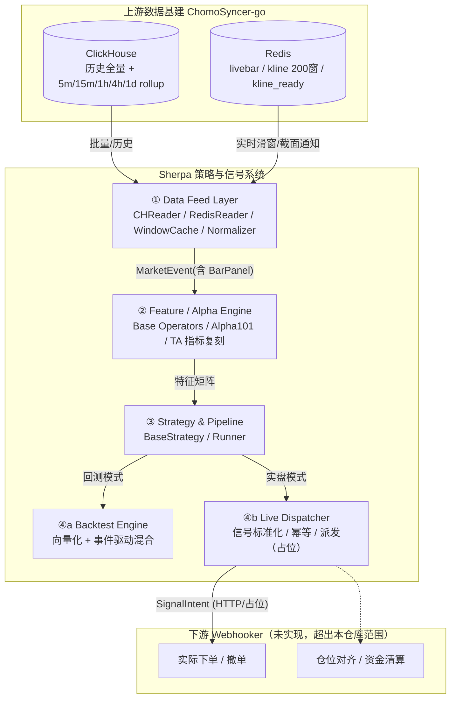

# Sherpa 策略引擎设计文档（初稿 v0.4）

> 本文档用于讨论，不是最终版。第5章数据契约和第6章 Alpha 引擎已经在代码里落地，其余模块先给出接口轮廓，细节留到对应阶段再展开。
>
> 范围声明：本仓库（Sherpa）只负责「从数据到交易意图（信号）」这一段。下单执行、撮合、仓位感知、资金清算属于下游 Webhooker（尚未实现），本设计里只保留一个对接用的抽象接口（`ISignalReceiver`），不涉及其内部实现。
>
> **v0.2 变更**：上游 `DATA_CONSUMER_GUIDE.md` 已更新——`kline:{SYM}:1m` 的紧凑数组从 9 元素改为 10 元素，`trades_count` 现已随 `[9]` 一起下发，Redis/ClickHouse 三处来源的核心字段已完全对齐。相应地，v0.1 里"`trades_count` 在实时窗口缺失"这条约束已解决，本版做了同步修正（详见 §3、§5.2.1、§5.4、§5.7）。第 5 章的数据契约（`BarPanel`/`MarketEvent`/`CHReader`/`RedisReader`/`Normalizer`/`WindowCache`/`IPanelSource`）已经在 `sherpa/data/` 落地并跑通了对真实 ClickHouse/Redis 环境的烟雾测试。
>
> **v0.3 变更**：`MarketEvent.bar_end_time` 的推导公式修正为对齐 Binance kline 的 close_time 惯例（`bar_start_time + interval_duration - 1ms`，不是直接等于下一根的 `bar_start_time`），详见 §5.4。
>
> **v0.4 变更**：第6章从接口占位改写成完整设计并在 `sherpa/alpha/` 落地——`Alpha` 基类、`AlphaEngine`、世坤101/TradingView/自定义三大家族、算子库 `ops.py`。确认了两条关键决策：多输出指标拆成多个单输出子类；`indneutralize` 因缺少行业分类数据暂不实现，占位报错。世坤101按经济含义分类到子模块（动量/反转/量价/波动率/形态/跨截面），已实现 8 个核实过的公式，其余待后续核对补充。
>
> **v0.5 变更**：第7章从接口占位改写成完整设计并在 `sherpa/strategy/` 落地——`TargetPosition`/`SignalIntent` 契约、`BaseStrategy`、`Runner`（`run_backtest`/`run_live` 都是 `run()` 的薄别名），以及下游对接子模块 `sherpa/strategy/sink/`（`ISignalReceiver` 协议 + `LogSink` 已实现，`BacktestSink`/`WebhookSink` 占位报错）。原第9章"下游对接"内容并入 §7.5，第9章改为指向 §7.5 的指引。第8章（回测引擎）仍是占位，未落地。
>
> **v0.6 变更**：新增 `docs/backtest_principle.md`（回测第一性原理，Alpha Check / Portfolio & Friction Check 两层体系），第8章据此从"回测引擎"改名为"回测与实盘驱动引擎"并重写——拆出 `sherpa.metrics`（纯统计：RankIC/IC_IR/分位数单调性、Sharpe/Calmar/MaxDrawdown）和 `sherpa.portfolio`（纯映射：alpha→权重、持仓漂移/换手率）两个跟 `sherpa.backtest` 平行、可被策略/未来实盘复用的模块，`sherpa.backtest` 变成组合调用它们的编排层。实盘执行模块给出占位小节（§8.5），明确"清算/PnL 归属 Webhooker"这条边界不变（方案A，已讨论确认）。第9章改写成三种 sink 的实例化/接线示例，不再重复设计决策。
>
> **v0.7 变更**：第8章从设计说明改写成完整落地——`sherpa/metrics/`（`factor.py`/`performance.py`）、`sherpa/portfolio/`（`weighting.py`/`turnover.py`）、`sherpa/backtest/`（`alpha_check.py`/`vectorized.py`/`event_driven.py`/`cost_model.py`/`result.py`）全部有代码和单元测试；`BacktestSink` 同步从占位报错改成真正转发给 `Simulator`（`WebhookSink` 仍是占位）。实现过程中发现并修正了三个数值上容易踩的坑，都已经写成回归测试：① `ic_summary` 原来对"std≈0"一律判 NaN，导致一个完美稳定的因子（IC 每期都≈1）反而被判不通过，现在区分"std≈0 且 mean≈0"（真 0/0，NaN）和"std≈0 但 mean 明显非零"（+inf）两种情况；② `annualized_return` 直接做 `total_growth ** (periods_per_year/n)` 在样本很短、频率很高时（比如 4 根 1m bar 外推全年）会 `OverflowError`，改成对数空间算指数、溢出时退化成 `inf`；③ `vectorized.py` 算换手时把"漂移用的收益率"和"算毛收益用的收益率"搞成了同一根 bar 的（应该是上一根 bar 的），这个 bug 是靠"向量化和事件驱动两条路径结果必须一致"（§8.4.4 决策2）这条交叉验证抓出来的——单纯跑通向量化路径自己的单元测试是发现不了的。

---

## 1. 定位与边界

Sherpa 是一个 **Data-to-Signal Engine**：

- 输入：ChomoSyncer-go 写入的 ClickHouse（历史/粗周期归档）+ Redis（1m 实时滑窗与截面通知）。
- 输出：标准化的交易意图（`TargetPosition` / `SignalIntent`），交给下游 `ISignalReceiver` 的具体实现去处理（回测用 `BacktestSink`，实盘先用 `LogSink` 占位，`WebhookSink` 留给未来）。
- 核心约束：**同一套策略代码，两种驱动方式**——历史回放（回测）和实时事件（实盘）必须复用同一个 `on_bar` 逻辑，差异只应该体现在「数据从哪来、多快到」，不应该体现在策略要写两套。

不在本次范围内：下单/撤单、仓位对齐、资金清算、滑点结算——这些是 Webhooker 的职责，本文档里只到「生成信号」为止。

---

## 2. 总体架构



模块编号与 `design.txt` 保持一致的层次关系，但把「③业务编排」放到「④回测/④实时」之前，避免看起来像并列的五个模块——实际上编排层是回测引擎和实时派发的共同上游。

---

## 3. 上游数据源速览（详见 `docs/DATA_CONSUMER_GUIDE.md`）

| 来源 | 内容 | 结构 | 覆盖周期 | 深度 |
| :-- | :-- | :-- | :-- | :-- |
| ClickHouse `market.fapi_kline_{1m,5m,15m,1h,4h,1d}` | OHLCV + quote_volume + taker_buy_* + trades_count + end_time | SQL 表，必须带 `FINAL` | 全周期 | 全历史 |
| Redis `livebar:{SYM}:1m` | 未收盘当前 bar | Hash（10 个字段，含 `n`=trades_count、`x`=是否收盘） | 仅 1m | 1 根 |
| Redis `kline:{SYM}:1m` | 最近 200 根已收盘 1m | List，keyless **10 元素**数组（`[9]`=trades_count） | 仅 1m | 200 根（约 3h20m） |
| Redis `stream:market:kline_ready` | 截面就绪通知（只有元数据，不带行情） | Stream | 全周期（粗周期是转发） | 最近 ~10000 条 |

需要显式设计应对的硬约束（这些是本文档第 5 节的主要出发点）：

1. **粗周期没有 Redis 滚动窗口**——只有 1m 有 `kline:{SYM}:1m`。实时场景下 5m/15m/1h/4h/1d 的「最近 N 根」必须由 Sherpa 自己去 ClickHouse 取；v0.2 的实现选择是每次 `kline_ready` 触发时现查整个 lookback，不维护常驻缓存（见 5.5 决策）。
2. **粗周期 `kline_ready` 事件的 `symbols_count` 不是该周期桶自己的到齐数**——它是从触发它的那次 `1m` 截面"借用"过来的（derived event，见上游 guide §4 "How the derived events are actually produced"），只能反映"这个桶最后一分钟有多少 symbol 报数"，不是"这个粗周期 bar 真正到齐了多少 symbol"。要精确覆盖率必须自己对 ClickHouse 该 bucket 做 `count()`。
3. **`kline_ready` 是尽力而为通知，不是可靠投递日志**——冷启动重连期间会被抑制且不补发，且一旦某分钟的 `1m` 通知被抑制，**该分钟恰好构成的所有粗周期边界通知也会被连带跳过**（比如一个整点分钟被抑制，那个小时的 `kline_ready` 也不会发）。数据接入层必须能表达"这个截面置信度不足"（用 `coverage_ratio` / `is_cold_start` 标记），不能假装每次都是完整截面。

（v0.1 中"`trades_count` 在 Redis 200 窗口缺失"的约束已随上游修复解决——现在 ClickHouse / `kline` 窗口 / `livebar` 三处的核心字段已完全对齐，唯一的例外只剩 `end_time`，见 §5.2.1。）

---

## 4. 术语统一

| 名称 | 含义 | 说明 |
| :-- | :-- | :-- |
| `BarPanel` | 多时间戳 × 多 symbol 的宽表容器（dict of 2D DataFrame） | 指标/Alpha 层唯一直接消费的数据结构 |
| `MarketEvent` | 一次「截面就绪」事件的信封 | 携带时间戳语义 + 指向当前 `BarPanel`（滚动窗口）的引用 |
| ~~`BarFrame`~~ | 废弃 | `design.txt` 里用它同时指"截面"和"面板"，含义不清，用 `BarPanel`（面板）+ `MarketEvent.latest`（单截面视图）替代 |

---

## 5. 核心：数据接入层 → 指标层 数据契约

这是当前的重点，下面写得比较细，方便逐条讨论。

### 5.1 内存结构选型结论

沿用 `指标输入结构.txt` 的分析，采纳 **方案一：dict of 2D DataFrame**（行 = `start_time`，列 = `symbol`）作为指标/Alpha 层的**唯一**对外接口：

- 和世坤 101 风格的截面算子天然契合：`panel.close.pct_change().rank(axis=1)` 这种写法不需要额外转换。
- 长表（方案二）只作为 ClickHouse 查询结果的**中间搬运格式**，在 Data Feed Layer 内部 pivot 成 `BarPanel` 后即丢弃，不暴露给指标层。
- 3D 张量（方案三）作为**可选的性能优化路径**（比如高频截面打分要用 Numba/Cython），由指标层内部按需从 `BarPanel` 转换，不作为跨层契约的强制形式——一旦定为跨层契约，指标代码就要处理 symbol 到下标的映射维护，得不偿失。

**硬性原则（继承自 design.txt 已经写对的一条）**：指标函数的输入只能是内存结构（`BarPanel` 或从它派生的 DataFrame/ndarray），禁止把 ClickHouse/Redis 连接实例传进指标函数。

### 5.2 `BarPanel` 规范

```python
@dataclass(frozen=True)
class BarPanel:
    schema_version: str            # 目前 "1.0"，跨层契约变更时必须升版本
    interval: str                  # "1m" / "5m" / "15m" / "1h" / "4h" / "1d"
    symbols: list[str]             # 列顺序即本窗口内的 symbol 并集，构造后不再重排

    open: pd.DataFrame             # index=UTC DatetimeIndex(name="start_time"), columns=symbols
    high: pd.DataFrame
    low: pd.DataFrame
    close: pd.DataFrame
    volume: pd.DataFrame
    quote_volume: pd.DataFrame
    taker_buy_volume: pd.DataFrame
    taker_buy_quote_volume: pd.DataFrame
    trades_count: pd.DataFrame      # 三路来源(CH/kline窗口/livebar)现已全部提供，视为一等字段，非 Optional

    coverage: pd.Series            # index 对齐到 open.index，每行 = 实际到齐symbol数/universe总数
    schema_notes: dict             # 预留：记录本次构造过程中的降级/异常情况，例如粗周期覆盖率是借用值而非精确计数
```

约定：

- **index**：`pd.DatetimeIndex`，`tz="UTC"`，名字固定 `start_time`，严格单调递增、无重复（对应上游"必须 FINAL 去重"的要求，去重在 Data Feed Layer 内部完成，不暴露给指标层）。
- **columns**：`symbols` 排序策略默认按字母序固定，保证同一次运行内所有字段 DataFrame 的列一致、可直接做逐元素运算；`BarPanel` 构造后列不再变（新增/退市 symbol 通过重新构造下一个 `BarPanel` 处理，见 5.3）。
- **dtype**：统一 `float64`（包括 `trades_count`，允许 NaN），不用 nullable Int，简化和 numpy/Numba 的互操作。
- **字段构建范围（已确认，v0.2）**：`Normalizer` 每次**全量构建全部 9 个字段**，不做"策略只用到哪几个字段就只 pivot 哪几个"的按需裁剪。先用最简单的方式把链路跑起来，真的遇到内存/延迟问题了再引入 `required_fields` 之类的按需机制（对应 §5.7 原问题 3，现已定为"先不做"）。
- **缺失值语义**：数据接入层**只负责如实反映缺失**（NaN），**不做 ffill/插值**——填充策略属于指标/策略层的业务判断（比如"停牌用前值"和"新币用 0"含义完全不同），不能在数据层被偷偷决定。

#### 5.2.1 字段可用性矩阵

| 字段 | ClickHouse | Redis `kline` 200窗 | Redis `livebar` |
| :-- | :--: | :--: | :--: |
| open/high/low/close | ✓ | ✓ | ✓ |
| volume / quote_volume | ✓ | ✓ | ✓ |
| taker_buy_volume / taker_buy_quote_volume | ✓ | ✓ | ✓ |
| trades_count | ✓ | ✓（数组 `[9]`，v0.2 起下发） | ✓（字段名 `n`） |
| end_time | ✓ | ✗ | ✗ |

三路来源现在对同一根 bar 保证是"同一次解析、逐字段一致"（上游 `KlineEvent` 只解码一次，分别喂给 CH row / compact array / live hash，不存在各自独立解析导致的不一致风险），所以 `BarPanel` 的 9 个核心字段（不含 `end_time`）可以统一按"一等字段"处理，不需要再区分数据来源、也不需要 5.7 中原先讨论的降级方案。

唯一的例外是 **`end_time`**：两个 Redis 结构都不携带它，只有 ClickHouse 有。`BarPanel` 不把 `end_time` 作为字段引入——`start_time` 已足够作为 index/join key，`end_time` 只在计算 `MarketEvent.bar_end_time`（防前视偏差用的时间戳）时需要，而这个值改为**自行推导**而不是依赖 CH 字段，见 5.4。

### 5.3 Universe 管理与对齐规则

- `BarPanel` 的 `symbols` 列表 = 构造时刻请求的 universe（来自 `universe.txt` 或 `CHReader.get_all_symbols()`）与窗口内实际出现过的 symbol 的并集。
- 新上线 symbol：上市前的行全部 NaN，不报错。
- 下架 symbol：默认保留列、后续全 NaN（`drop_delisted=False`），可配置为直接从下一次窗口构造起剔除。
- **Point-in-time universe（防止回测幸存者偏差）**——**已确认方案**：ClickHouse 没有专门记录"symbol 首次上线时间"的字段，只能通过查每个 symbol 最早一条 1m 记录的 `start_time` 来倒推：

  ```sql
  SELECT symbol, min(start_time) AS listed_at
  FROM market.fapi_kline_1m FINAL
  GROUP BY symbol
  ```

  `CHReader.get_listing_times() -> dict[str, pd.Timestamp]` 封装这条查询，`Universe.as_of(t)` 用它过滤出 `listed_at <= t` 的 symbol 集合。这是一次全表 `GROUP BY`，成本不低，所以不在每次构造 `BarPanel` 时都查：由 `Universe` 对象在会话/回测启动时查一次并缓存在内存里（本仓库生命周期内 symbol 上线时间不会变，不需要考虑失效），Data Feed Layer 只读缓存结果。退市目前没有专门标记，仍按"该 symbol 之后再无新行"处理（即 5.3 现有的"下架保留列、后续 NaN"规则）。

### 5.4 `MarketEvent` 规范

```python
@dataclass(frozen=True)
class MarketEvent:
    interval: str
    bar_start_time: pd.Timestamp    # 收盘K线的 start_time，是跨 CH/Redis 的 join key
    bar_end_time: pd.Timestamp      # = 数据实际可用的时刻，防前视偏差的权威时间戳
    symbols_count: int
    coverage_ratio: float           # symbols_count / 配置 universe 大小
    is_cold_start: bool = False     # 上游重连补历史期间产生的低置信事件
    panel: BarPanel                 # 截至 bar_end_time 的滚动窗口（只读视图，不拷贝）
```

**为什么要同时留 `bar_start_time` 和 `bar_end_time`**：上游文档强调 `start_time` 是所有存储的 join key，但它是 bar 的**开盘**时间；真正"这根 bar 的信息在什么时刻才能被观测到"是 `end_time`（约等于下一根的 open）。策略在 `bar_end_time` 生成的信号，只能在 `bar_end_time` 之后成交，不能用同一根 bar 的收盘价直接无损入场——这是 `design.txt` 已经强调的规则，这里把它落到字段上，回测引擎撮合时直接读 `event.bar_end_time` 做撮合时间下限，不需要每个策略自己记住这条规则。

**`bar_end_time` 的取值方式（v0.3 修正：对齐 Binance close_time 惯例）**：两个 Redis 结构都不带 `end_time`（见 5.2.1），实时路径不应该为了拿一个时间戳去多打一次 ClickHouse。所以约定由 Data Feed Layer 自行计算，不依赖任何上游字段——但计算公式不是简单的 `start_time + interval_duration`，而是要**减去 1 毫秒**：

```text
bar_end_time = bar_start_time + interval_duration - 1ms
```

原因：上游数据源跟 Binance kline 走的是同一套 close_time 惯例——一根 1m bar 覆盖的区间是 `[10:00:00.000, 10:00:59.999]`，闭区间右端点比下一根的 `start_time`（`10:01:00.000`）小 1ms，不是相等。这不是拍脑袋定的时间戳偏移，而是要跟上游 ClickHouse 的 `end_time` 字段值真正对齐——`end_time` 字段本身就是照抄 Binance 的 close_time，如果我们自己推导时不减这 1ms，回测路径"用 CH 的 end_time 做一致性校验"这个说法就会系统性地对不上（永远差 1ms）。

这条 1ms 偏移**不影响防前视偏差的正确性，反而让它更精确**：真正干净的边界关系是

```text
下一根 bar 的 bar_start_time == 这一根 bar 的 bar_end_time + 1ms
```

回测撮合层的规则仍然是"订单只能在 `event.bar_end_time` 之后成交"，而 `bar_end_time` 现在精确到 Binance 语义下这根 bar 覆盖区间的最后一毫秒，下一笔可能成交的时间点就是紧接着的 `bar_end_time + 1ms`（=下一根的 open）——语义比 v0.2 版本（`bar_end_time` 直接等于下一根 open）更贴近上游数据的真实时间戳，不存在"提前 1ms 看到下一根开盘"的风险，两者对回测正确性的保证是等价的，只是现在字段值本身是"对"的。

**`coverage_ratio` 在粗周期上的取值方式**：`kline_ready` 通知里的 `symbols_count` 对粗周期事件而言是从触发它的那次 `1m` 截面借用的数值，**不代表该粗周期 bar 自身的真实到齐率**（见 §3 约束 2）。因此：

- 对 `interval="1m"` 的 `MarketEvent`：`coverage_ratio` 直接用通知里的 `symbols_count / universe_size`。
- 对粗周期的 `MarketEvent`：现查 ClickHouse 时用**这根新 bar 实际查询回来的行数**重新计算 `coverage_ratio`（同一次 `fetch_history` 顺带算，不用再单独查一次 `count()`），不直接采用通知里的 `symbols_count`。这个偏差来源要在 `schema_notes` 里留一条记录，方便调试时区分"数据层修正过的覆盖率"和"原始通知值"。

### 5.5 数据接入层内部结构

不是一个 `CHReader`/`RedisReader` 糊到一起，拆成三个职责明确的组件：

| 组件 | 是否有状态 | 职责 |
| :-- | :-- | :-- |
| `CHReader` / `RedisReader` | 无状态 | 纯粹的 I/O 封装，返回各自原始格式（DataFrame / 数组 / Hash），不做业务转换 |
| `Normalizer` | 无状态 | 把 CH 长表 或 Redis 原始结构映射成 `BarPanel` 的字段（pivot、类型转换、字段对齐），是 5.2.1 那张矩阵的代码落点 |
| `WindowCache` | **有状态（仅 `1m`）** | 维护 `1m` 的当前滚动窗口，处理 seed（初始化）+ append（增量）+ evict（超出 lookback 的旧数据剔除） |

**已确认方案（v0.2）**：`WindowCache` 只对 `1m` 有意义，是本设计里唯一有状态的数据组件；粗周期（`5m/15m/1h/4h/1d`）**不维护常驻缓存**，每次 `kline_ready` 触发时直接现查 ClickHouse 所需的完整 `lookback_bars`——实现最简单，先把链路跑通，等实测有性能瓶颈了再考虑引入增量缓存。具体：

- **`1m`（有状态）**：启动时 `LRANGE kline:{SYM}:1m 0 199` 做 seed（10 元素数组，`trades_count` 随 `[9]` 一起拿到，不需要再单独补）；`kline_ready(interval="1m")` 到来后，append 最新一根，弹出最旧一根，保持固定窗口长度；`coverage_ratio` 直接取通知里的 `symbols_count`。
- **`5m/15m/1h/4h/1d`（无状态，每次现查）**：`kline_ready(interval=coarse)` 到来后，直接对 ClickHouse 跑一次 `fetch_history(symbols, interval, lookback_bars=N)`，拿回来的 DataFrame 整体替换成新的 `BarPanel`，不做增量 append/evict；`coverage_ratio` 用同一次查询里最新一根 bar 的 `count()` 计算，不信任通知自带的 `symbols_count`（见 5.4）。
- **级联抑制的处理**：如果一个粗周期 bucket 该来的 `kline_ready` 一直没来（因为构成它的某个 `1m` 被上游抑制了），数据层不会凭空补数据——这个 bucket 就是没有对应的 `MarketEvent` 触发，由 Pipeline/策略层根据自身对"多久没收到该周期通知"的容忍度决定要不要主动轮询兜底，数据层本身不做隐式猜测或超时重试。

### 5.6 统一驱动接口：`IPanelSource`

这是把 `design.txt` "同一套策略代码，两套驱动方式" 落地成接口的地方：

```python
class IPanelSource(Protocol):
    def universe(self, as_of: pd.Timestamp | None = None) -> list[str]: ...
    def __iter__(self) -> Iterator[MarketEvent]: ...
```

- `HistoricalPanelSource`：构造时一次性把回测区间的数据组织好，`__iter__` 按 bar 顺序逐个 yield `MarketEvent`，**每个 event 的 `panel` 严格只包含 `index <= bar_end_time` 的数据**（这里是防前视偏差的第二道保险，第一道是撮合时间约束）。
- `LivePanelSource`：阻塞监听 `stream:market:kline_ready`；`interval="1m"` 的通知交给内部持有的 `WindowCache` 做增量更新，粗周期通知直接现查 ClickHouse 拿完整窗口（见 5.5），两种情况都统一包装成 `MarketEvent` yield 出去。

Pipeline 层的主循环因此可以完全不关心是回测还是实盘：

```python
for event in panel_source:
    features = alpha_engine.compute(event.panel)
    intents = strategy.on_bar(event, features)
    sink.submit(intents)   # 回测: BacktestSink；实盘: LogSink / 未来的 WebhookSink
```

### 5.7 已确认的设计决策

以下四条原本是开放问题，现已拍板，后续实现直接按此执行；对应的正文（5.2 / 5.3 / 5.5）已同步更新。

| # | 问题 | 决策 |
| :-- | :-- | :-- |
| 1 | 粗周期实时链路要不要常驻 `WindowCache` | **不要**。简化为"`kline_ready` 触发时现查 ClickHouse 所需 lookback"，暴力但简单；性能不够再优化（见 5.5）。 |
| 2 | Point-in-time universe 能否实现 | ClickHouse 没有专门字段，用 `GROUP BY symbol, min(start_time)` 查每个 symbol 最早出现的 bar 倒推上线时间，会话启动时查一次缓存在内存（见 5.3）。 |
| 3 | `BarPanel` 要不要按需字段构建 | **先不做**，每次全量构建全部 9 个字段，有性能问题再引入 `required_fields`（见 5.2）。 |
| 4 | 粗周期 `coverage_ratio` 怎么算 | 既然粗周期改成每次现查完整 lookback（决策1），顺带用查询结果的 `count()` 重算覆盖率，不用通知自带的 `symbols_count`（见 5.4/5.5）。 |

`trades_count` 在实时窗口缺失的问题已随上游 `DATA_CONSUMER_GUIDE.md` 更新自然解决（见 v0.2 变更说明），不在此列。

---

## 6. 指标 / Alpha 层设计（`sherpa.alpha`）

代码已经按本节落地在 `sherpa/alpha/` 下，本节是设计说明，代码是权威实现，两者应保持同步。

### 6.1 `BarPanel` 怎么被这一层消费、输出是什么结构

Alpha 层不知道 `MarketEvent`/`IPanelSource`/ClickHouse/Redis 的存在，唯一输入是第 5 章定义的 `BarPanel`；Pipeline 层负责把 `event.panel` 递给它：

```python
for event in panel_source:                       # 第5章：回测/实盘统一驱动
    features = alpha_engine.compute(event.panel)   # 第6章：本节
    intents = strategy.on_bar(event, features)      # 第7章
    sink.submit(intents)
```

三层输出结构，分别对应三个不同粒度的使用场景：

| 谁调用 | 方法 | 输出 | 用途 |
| :-- | :-- | :-- | :-- |
| 单个 `Alpha` | `compute(panel)` | `(T, N)` DataFrame，index/columns 跟 `panel` 完全对齐 | 向量化回测、因子研究要看完整历史 |
| 单个 `Alpha` | `latest(panel)` | `pd.Series`，index=symbol | 只要当前这根截面的分数，`compute()` 的最后一行 |
| `AlphaEngine` | `compute(panel)` | `(symbol × alpha名)` DataFrame | **喂给 `strategy.on_bar` 的 `features`**，每个 alpha 一列，行是 symbol |
| `AlphaEngine` | `compute_history(panel)` | `dict[qualified_name, (T,N) DataFrame]` | 向量化回测/因子研究，一次性拿所有 alpha 的完整历史 |

为什么 `compute()` 要返回完整 `(T,N)` 历史而不是只算最新一行：向量化回测（第8章）需要因子的整段历史去算 IC/分层收益，只在事件循环里算最后一行喂给实时策略是"够用但不完整"的子集，所以把"算完整历史"定为唯一契约，"只要最后一行"退化成一个便捷方法（`.latest()`），而不是反过来。

### 6.2 `Alpha` 基类契约

```python
class Alpha:
    name: str = ""
    family: str = "custom"      # "worldquant" | "tradingview" | "custom"
    min_lookback: int = 1        # 这个因子至少要多少根K线才可能有非NaN值

    def compute(self, panel: BarPanel) -> pd.DataFrame: ...
    def latest(self, panel: BarPanel) -> pd.Series: ...   # 默认实现 = compute(panel).iloc[-1]

    @property
    def qualified_name(self) -> str:
        return f"{self.family}.{self.name}"                # 如 "worldquant.alpha006"
```

**已确认的设计决策（跟你讨论后拍板的）**：

1. **一个 `Alpha` 只产出一条分数序列，不支持多输出。** 布林带/MACD/KDJ 这类天生有好几条线的指标，拆成多个单输出子类分别注册（比如 `BollingerUpper`/`BollingerMid`/`BollingerLower` 各自是一个 `Alpha`）。好处是任何 alpha 之间都能自由组合、被 `AlphaEngine` 统一拼进同一张特征矩阵，不需要为"这个因子是不是多输出"写特殊分支；代价是三个子类可能重复计算共享的中间量（比如都要重新算一次 rolling mean/std），先不处理，真出现性能问题再考虑"同一次 compute 周期内的中间量缓存"。
2. **`indneutralize`（行业中性化）v1 不实现。** crypto 永续市场没有天然的"行业"分类维度，`BarPanel` 也没有这个字段。带这个算子的世坤101公式全部先跳过——不拿代理维度（比如按上线时间/报价币种分组）硬凑，错的因子比没有因子更危险。落地方式：`ops.indneutralize()` 和 `worldquant.cross_sectional.IndustryNeutralPlaceholder` 都是直接 `raise NotImplementedError`，作为以后真有分类数据时的统一接入点。
3. **`min_lookback` 是因子自己声明的保守上界，不是精确边界。** 用来提醒 Pipeline/Runner 层（第7章）在配置 `panel_source` 的 `lookback_bars` 时至少要给多少——`AlphaEngine.required_lookback` = 引擎里所有 alpha 的 `min_lookback` 最大值。它是"上界"是因为个别公式的实际 warmup 可能比声明值短（见 6.5 Alpha001 的例子），但绝不会比声明值长，这个方向的保守是安全的。
4. **注册机制用显式装饰器 `@register_alpha`，不用 `__init_subclass__` 暗中注册。** 显式好于隐式：谁被注册、什么时候被注册一眼能看到，测试里定义的临时 Alpha 子类也不会污染全局 registry。`qualified_name` 强制带家族前缀（`"worldquant.alpha006"` / `"tradingview.rsi_14"` / `"custom.my_momentum"`），避免 101 个 + 一堆 TA 指标 + 用户自定义互相之间撞名。

### 6.3 三大家族

```text
sherpa/alpha/
  ops.py                 # 无状态算子库：rank/scale/indneutralize（横截面），
                          # delay/delta/ts_sum/ts_min/ts_max/stddev/ts_rank/
                          # ts_argmax/ts_argmin/ts_corr/ts_cov/decay_linear（时序），
                          # signed_power/sign/log（逐元素），adv/vwap（常见子表达式）
  base.py                 # Alpha / AlphaRegistry / register_alpha / custom_alpha
  engine.py               # AlphaEngine
  worldquant/             # 世坤101风格因子，按经济含义分类到子模块：
    momentum.py            动量类：押注趋势延续                    Alpha009
    reversal.py             反转/均值回归类：押注极端表现会被修正        Alpha004
    volume_price.py          量价关系类：volume 和 price 的联动/背离     Alpha002/003/006/012
    volatility.py            波动率类：用价格离散度构造信号            Alpha001
    pattern.py               价格形态类：K线内部结构/形状              Alpha101
    cross_sectional.py        跨截面/行业中性类：依赖 indneutralize，占位不实现
  tradingview/            # TA 指标复刻：RSI、ATR（先两个打样，其余按需补）
  custom/                 # 用户自定义：CustomAlpha 子类 或 @custom_alpha 装饰函数
```

三个家族共用同一个基类，区别只是 `family` 字段和"公式的经济含义/出处"：

```python
class WorldQuantAlpha(Alpha):   family = "worldquant"
class TradingViewIndicator(Alpha):  family = "tradingview"
class CustomAlpha(Alpha):       family = "custom"
```

**世坤101已实现子集**（8/101，都不依赖 `indneutralize`/市值）：

| 分类 | Alpha | 公式 | 一句话含义 |
| :-- | :-- | :-- | :-- |
| 动量 | Alpha#9 | 连续5根同向延续，否则反转当根变动 | 趋势确认 |
| 反转 | Alpha#4 | `-1 * ts_rank(rank(low), 9)` | 低价持续偏低的做反向 |
| 量价 | Alpha#2 | 成交量变化率与实体涨跌幅的横截面负相关 | 量价背离 |
| 量价 | Alpha#3 | `-1 * correlation(rank(open), rank(volume), 10)` | 开盘价-成交量背离 |
| 量价 | Alpha#6 | `-1 * correlation(open, volume, 10)` | 同上，不做横截面排名 |
| 量价 | Alpha#12 | `sign(delta(volume,1)) * -delta(close,1)` | 放量时价格反转 |
| 波动率 | Alpha#1 | 下跌用波动率/上涨用收盘价，找5根内极值位置 | 波动聚集 + 反转 |
| 形态 | Alpha#101 | `(close-open)/((high-low)+.001)` | 收盘强弱 |

**其余 ~93 个公式暂未实现**——101 篇公式全部逐条核实工作量很大，没有把握的宁可先留空，也不往交易系统里塞没核实过的公式。新增一个因子的流程：找经济含义最接近的分类文件（没有合适的就新建一个），继承 `WorldQuantAlpha`，用 `@register_alpha` 注册，公式本身对着原始论文核对，不要凭印象默写。

**TradingView 家族**目前实现 `RSI`、`ATR` 两个打样，模式相同：继承 `TradingViewIndicator`，参数化的指标（比如 `RSI(period=14)`）在 `__init__` 里把 `self.name` 改成带参数后缀的形式（`"rsi_14"`），避免同一个引擎里放两个不同 period 的 RSI 时 `qualified_name` 撞车。

**自定义家族**给两种写法：需要参数/状态的继承 `CustomAlpha` 写类；"一个纯函数就是一个因子"的用 `@custom_alpha("name", min_lookback=N)` 装饰一个 `(panel) -> DataFrame` 函数，装饰器会自动包成一个 `CustomAlpha` 子类并注册。

### 6.4 `AlphaEngine`

```python
class AlphaEngine:
    def __init__(self, alphas: Sequence[Alpha]): ...
    def compute(self, panel: BarPanel) -> pd.DataFrame: ...          # (symbol × alpha名)，喂给 on_bar
    def compute_history(self, panel: BarPanel) -> dict[str, pd.DataFrame]: ...  # 向量化回测用
    @property
    def required_lookback(self) -> int: ...                          # max(a.min_lookback for a in alphas)
```

构造时按 `qualified_name` 查重，同一个引擎里不能放两个 `qualified_name` 相同的 alpha 实例（比如两个都没改名的 `RSI()`）——这也是 6.2 决策3 强调"参数化指标要把参数编进 name"的原因。

### 6.5 一个真实踩到的坑：pandas 的 `NaN` 比较陷阱

实现 Alpha#9（`(0 < ts_min(delta(close,1),5)) ? d : ...`）时踩到一个值得记录的通用陷阱：pandas/numpy 里 `NaN > 0` 直接算 `False`（不是 `NaN`），所以滚动窗口还没攒够 5 根、`ts_min`/`ts_max` 本身还是 `NaN` 的阶段，`(ts_min > 0) | (ts_max < 0)` 这个布尔条件会被悄悄判成 `False`，导致 `d.where(trending, -d)` 在 warmup 阶段冒出一个"看起来正常但没有意义"的数值，而不是老老实实地是 `NaN`。

修法是显式拿 `ts_min.notna()` 把这部分重新盖成 NaN（`sherpa/alpha/worldquant/momentum.py`）。这条经验对所有"用布尔比较模拟三元表达式"的公式都适用，写新公式时要留意：**凡是条件里出现滚动聚合结果，warmup 阶段的 NaN 传播不能只靠"公式看起来会自然产出 NaN"来保证，要显式检查。**

### 6.6 v1 范围内不做的事（明确排除，避免过度设计）

- **增量计算**：`Alpha.compute()` 每次都是对整个传入的 `panel` 重新做向量化计算，不维护跨调用的状态。如果之后 `ts_corr` 这类滚动窗口算子在高频截面场景下性能不够，再考虑给 `Alpha` 加一个可选的 `update(event) -> pd.Series` 增量接口，v1 不做。
- **跨 alpha 的中间量缓存**：6.2 决策1 提到的"布林带三个子类重复算 rolling mean/std"，v1 先接受这个重复计算成本。
- **行业中性化**：见 6.2 决策2，等有可信的分类数据源再回来做。

## 7. 策略编排层（`sherpa.strategy`）

代码已按本节落地在 `sherpa/strategy/` 下，本节是设计说明，代码是权威实现，两者应保持同步。

### 7.1 职责边界

`Runner` 是整个引擎的编排核心，串起第5章数据契约、第6章特征层和下游 sink：

```python
for event in panel_source:                             # 第5章：回测/实盘统一驱动
    features = alpha_engine.compute(event.panel)        # 第6章：特征矩阵
    target = strategy.on_bar(event, features)            # 本章 §7.3：纯策略逻辑
    intents = self._to_intents(event, target)             # 本章 §7.4：标准化
    sink.submit(intents)                                   # 本章 §7.5：下游对接
```

`BaseStrategy` 只负责"这根 bar 我要什么仓位"这一件事，不知道自己是被回测还是实盘调用；
把 `TargetPosition` 标准化成携带 `event_id`/`generated_at` 等元数据的 `SignalIntent` 是
`Runner` 的职责——这样回测和实盘复用同一个 `on_bar` 时，策略代码不会被"造ID"这类编排细节
污染。

**与第2节架构图的对应关系**：图中④a `Backtest Engine` 内部会调用 `BacktestSink`；
④b `Live Dispatcher` 标注的"信号标准化 / 幂等 / 派发"三项职责，v1 里"标准化"由
`Runner._to_intents` 承担，"派发"由 `WebhookSink` 承担（占位未实现），"幂等"目前完全没有
实现，见 §7.6。

### 7.2 `TargetPosition` / `SignalIntent` 契约（`sherpa/strategy/schema.py`）

```python
@dataclass(frozen=True)
class TargetPosition:
    weights: Mapping[str, float] = field(default_factory=dict)   # symbol -> 目标仓位百分比
    def items(self): ...

@dataclass(frozen=True)
class SignalIntent:
    event_id: str
    strategy_id: str
    symbol: str
    signal_type: str          # v1 固定 "target_percent"
    target_percent: float
    bar_end_time: pd.Timestamp
    generated_at: pd.Timestamp
```

**已确认的设计决策**：

1. `TargetPosition` 只装权重字典，不做归一化/裁剪校验（比如权重总和是否超过1、单 symbol
   是否超过仓位上限）——那是回测撮合/风控的职责，不是信号契约的职责，本层只负责如实传递
   策略给出的数字。
2. `signal_type` 目前只有一种取值 `"target_percent"`（对应 `design.txt` 提到的"买/卖/平/
   目标仓位"里最通用的一种）。如果以后要支持相对下单（比如"减仓10%"而非"到X%"），在这里
   加新的 `signal_type` 取值，`TargetPosition` 的结构不用变。

### 7.3 `BaseStrategy`（`sherpa/strategy/base.py`）

```python
class BaseStrategy:
    strategy_id: str = ""      # 默认取类名，可覆写

    def __init__(self, **params): ...
    def setup(self) -> None: ...      # Runner 主循环开始前调用一次，默认空实现
    def on_bar(self, event: MarketEvent, features: pd.DataFrame) -> TargetPosition: ...
```

`features` 就是 `AlphaEngine.compute(event.panel)` 的输出：index=symbol，columns=各 alpha
的 `qualified_name`。策略作者只需要继承这一个类，不需要知道 `IPanelSource`/`ISignalReceiver`
的存在。

### 7.4 `Runner`（`sherpa/strategy/runner.py`）

```python
class Runner:
    def __init__(self, strategy: BaseStrategy, alpha_engine: AlphaEngine, sink: ISignalReceiver): ...
    def run(self, panel_source: IPanelSource) -> None: ...
    def run_backtest(self, panel_source: IPanelSource) -> None: ...   # 语义化别名，委托给 run()
    def run_live(self, panel_source: IPanelSource) -> None: ...       # 语义化别名，委托给 run()
```

**已确认的设计决策**：

1. **`run_backtest`/`run_live` 不允许分叉出两份主循环逻辑**——两者都是 `run()` 的薄别名，
   唯一差异必须体现在调用方注入的 `panel_source`/`sink` 具体类型上（比如
   `HistoricalPanelSource` + `BacktestSink` vs `LivePanelSource` + `WebhookSink`）。这是
   设计文档反复强调的硬约束"同一套策略代码，两种驱动方式"在代码层面的落地方式，`Runner`
   的实现里不能出现 `if backtest: ... else: ...` 这种分叉。
2. `_to_intents` 每次 `on_bar` 调用生成一个共享的 `event_id`（`uuid4`）和 `generated_at`
   （调用时刻，UTC）；同一次 `on_bar` 产出的多个 symbol 的 `SignalIntent` 共享这两个值——
   它们描述的是"同一次决策"，不是"同一个 symbol 各自独立的多次决策"。
3. 目标仓位为空（`on_bar` 返回 `None`，或返回的 `TargetPosition` 没有权重）时不调用
   `sink.submit()`，避免下游收到一次没有信息量的空列表调用。

### 7.5 下游对接子模块 `sherpa/strategy/sink/`

`ISignalReceiver` 协议和三个具体实现按驱动方式拆成独立文件，互不感知彼此的存在，只共享
`base.py` 里的协议定义：

```text
sherpa/strategy/sink/
  base.py              # ISignalReceiver Protocol
  log_sink.py           # LogSink：只落日志，v1 唯一可用的实现
  backtest_sink.py        # BacktestSink：已实现（v0.7），转发给 sherpa.backtest.event_driven.Simulator
  webhook_sink.py           # WebhookSink：占位，raise NotImplementedError，依赖下游 Webhooker
```

```python
class ISignalReceiver(Protocol):
    def submit(self, intents: Sequence[SignalIntent]) -> None: ...
```

**已确认的设计决策**：

1. **拆子模块而不是一个文件里放三个类**——理由和 §6.3 世坤101按经济含义拆子模块一致：
   `BacktestSink` 要接撮合状态机（持仓/资金/滑点），`WebhookSink` 将来要接 HTTP
   重试/幂等/签名，这两个的实现复杂度和 `LogSink` 不是一个量级，放一个文件里会互相干扰
   阅读和测试；拆开后每种实现可以独立演进、独立测试。
2. **`BacktestSink` 落地后依然只是薄转发层，不是简化实现**——跟 §6.2 决策2（`indneutralize`
   占位）同一个原则的另一面：宁可等第8章的 `Simulator` 真正落地了再让 `BacktestSink` 可用，
   也不要在那之前塞一个"看起来能跑但没有真实撮合"的版本进去，那样产出的数字会被误认成
   真实回测收益，比不实现更危险（v0.6 时的决定）。v0.7 落地后，`BacktestSink.submit()`
   本身仍然不包含任何换手/成本/净值逻辑——那些全部在 `sherpa.backtest.event_driven.Simulator`
   里（见 §8.4.3/§9.2），`BacktestSink` 只是把 `intents` 转发过去，这条"sink 只是调用者"的
   原则在真正实现之后依然成立，不是权宜之计。`WebhookSink` 目前仍是占位报错，原则不变：
   在它落地之前，`run_live` 可以先接 `LogSink`，只验证 Pipeline 主循环本身
   （数据 → 特征 → 策略 → 信号）跑得通，不代表实盘结果可信。

### 7.6 v1 范围内不做的事（明确排除，避免过度设计）

- **风控/仓位裁剪**：见 §7.2 决策1，`TargetPosition` 不做任何校验，风控是策略自己的职责
  或者未来独立的一层。
- **信号去重/幂等**：`Runner` 每次 `on_bar` 都生成新的 `event_id`，不检测"这根 bar 是不是
  已经发过信号了"——如果 `panel_source` 在实盘场景下意外重复 yield 同一个 `bar_start_time`
  的事件（不应该发生，但目前没有代码层面的防御），会产生重复的 `SignalIntent`。幂等应该是
  `WebhookSink` 落地时的职责（它离真实下单最近，重复下单的后果也最大），不在这一层解决，
  对应第2节架构图里④b "幂等"这项当前尚未实现。

## 8. 回测与实盘驱动引擎（`sherpa.metrics` / `sherpa.portfolio` / `sherpa.backtest`，实盘执行占位）

> 本章的两层划分——**Alpha Check**（信息预测力检验）与 **Portfolio & Friction Check**（真实
> 可变现性验证）——直接来自 [`docs/backtest_principle.md`](backtest_principle.md)（回测第
> 一性原理）。数学定义和推导以那份文档为准，本章只负责把它落地成模块结构和接口边界，不
> 重复公式。

### 8.1 为什么从"回测引擎"改名，`metrics`/`portfolio` 为什么要独立出来

`backtest_principle.md` 里的两层拆开看，会发现真正"只服务于历史回放"的东西其实很少：

- **第一层（Alpha Check）**的 RankIC/IC_IR/分位数单调性，只是"给定 alpha 矩阵 + 未来收益率
  矩阵，算统计量"，跟这两个矩阵是历史数据还是别的来源完全无关。
- **第二层（Portfolio & Friction Check）**里的"alpha→权重映射"（截面去均值+L1、Top-K）和
  "持仓漂移/换手率计算"，是策略作者在 `on_bar()` 里随时会用到的东西——回测第二层不过是
  "把同一个映射函数在历史数据上跑一遍"而已。
- 换手/成本扣完之后的 Sharpe/Calmar/MaxDrawdown 等绩效指标，同样只是"给定一条收益率序列
  算统计量"，不关心这条序列是回测模拟出来的还是别处来的。

如果把这些都锁在"回测引擎"这个标题/包名下，会造成两个问题：一是命名上让人误以为它们只
服务于历史回放；二是未来实盘要用同一套仓位映射逻辑时，会被迫依赖一个名叫 `backtest` 的
包，语义上很别扭，而且 `backtest` 包以后长出的重依赖（比如更复杂的撮合模拟）会被无关地
一起带进实盘代码。这和业内 `alphalens`（纯因子检验，独立于任何具体回测引擎）、`pyfolio`
（纯绩效指标，既能吃回测收益率序列也能吃实盘收益率序列）把"检验/指标"和"模拟引擎"分成
两个库的做法是一致的思路，本仓库照此拆分。

拆分后的依赖方向严格单向：

```text
sherpa.backtest  ──depends on──>  sherpa.metrics
sherpa.backtest  ──depends on──>  sherpa.portfolio
sherpa.strategy  ──depends on──>  sherpa.backtest   (仅 BacktestSink 这一处)
（未来）sherpa.live  ──depends on──>  sherpa.portfolio   (见 §8.5，不依赖 metrics)
```

`metrics`/`portfolio` 不反过来依赖 `backtest`/`strategy` 的任何东西，这样它们才能被研究
脚本、未来实盘模块、乃至仓库之外的地方单独拿去用。

### 8.2 `sherpa.metrics`：纯统计函数

```text
sherpa/metrics/
  factor.py        # RankIC / IC_IR / 分位数单调性（backtest_principle.md 第一层）
  performance.py     # Sharpe / Calmar / MaxDrawdown / 换手衰减（backtest_principle.md 第二层）
```

**已确认的设计决策**：

1. 这个包只依赖 `pandas`/`numpy`，不 import 本仓库任何其他模块（`data`/`alpha`/`strategy`/
   `backtest` 都不碰）——保证它可以被完全脱离 Sherpa 其余部分单独测试、单独复用。
2. `factor.py` 里的函数只吃两个矩阵：alpha 分数 `(T,N)` DataFrame + 未来收益率 `(T,N)`
   DataFrame，返回逐期 RankIC 序列 + 汇总统计（mean/std/IC_IR）+ 分位数分组收益表——不做
   任何截面预处理（去极值/中性化），那是调用方（`backtest.alpha_check`）的职责，`metrics`
   只管算统计量。
3. `performance.py` 里的函数只吃一条收益率 `pd.Series`，不关心它从哪来——这条边界是为了
   §8.5 提到的可能性预留的：如果以后 Webhooker 想直接复用这几个公式去算自己的实盘 Sharpe，
   它只需要一条收益率序列，不需要引入 Sherpa 的模拟/数据层依赖。

### 8.3 `sherpa.portfolio`：alpha → 权重的纯函数映射

```text
sherpa/portfolio/
  weighting.py    # demean_l1 / top_k_long_short / equal_weight
  turnover.py       # 持仓漂移 W_drift + 换手率计算
```

**已确认的设计决策**：

1. `weighting.py` 每个函数的签名统一是"一个截面的 alpha 分数 → 一个截面的目标权重
   `pd.Series`"，纯函数、无状态。**同一个函数**在向量化回测第二层调一次、在
   `BaseStrategy.on_bar()` 里调一次——两处产出的权重口径必须完全一致，这是刻意设计：避免
   "回测用一套映射公式、实盘/策略代码另写一套"这种最终导致回测结果和实盘表现对不上的
   经典坑。
2. `turnover.py` 落地 `backtest_principle.md` §2(4) 的持仓漂移计算：给定上一期目标权重 +
   期间实际收益率，算出漂移后的权重 `W_drift`，再和新一期目标权重比较得出换手率。这个计算
   同样不是回测专属——未来如果要做实盘"持仓偏离目标仓位超过阈值就触发再平衡"的监控，同一
   个函数可以直接复用（见 §8.5）。

### 8.4 `sherpa.backtest`：编排层

```text
sherpa/backtest/
  alpha_check.py     # 第一层入口
  vectorized.py         # 第二层·向量化入口
  event_driven.py          # 第二层·事件驱动入口（BacktestSink 唯一直接调用的东西）
  cost_model.py               # 手续费/滑点模型，向量化和事件驱动两条路径共用
  result.py                     # AlphaCheckResult / BacktestResult
```

#### 8.4.1 第一层入口：`alpha_check.py`

```python
def run_alpha_check(
    alpha_history: pd.DataFrame,      # (T,N)，来自 AlphaEngine.compute_history()
    forward_returns: pd.DataFrame,     # (T,N)，跟 alpha_history 对齐的未来收益率
    *,
    n_quantiles: int = 10,
    ic_ir_threshold: float = 0.5,
) -> AlphaCheckResult: ...
```

调用 `sherpa.metrics.factor` 里的函数算 RankIC 序列/IC_IR/分位数单调性，不做任何仓位/成本
计算——完全对应 `backtest_principle.md` 第一层"无交易摩擦、纯统计假说检验"的假设。
`ic_ir_threshold` 显式做成参数而不是写死常量，因为原理文档里明确指出不同频率的因子阈值
不一样（日频通常要求 IC 均值 >0.03~0.05，分钟级 0.01~0.02 就有价值）；`passed=False` 时
只是给出建议，`backtest` 模块本身不阻止调用方继续跑第二层。

#### 8.4.2 第二层·向量化入口：`vectorized.py`

```python
def run_vectorized_backtest(
    alpha_history: pd.DataFrame,
    panel: BarPanel,
    weighting_fn: Callable[[pd.Series], pd.Series],   # 来自 sherpa.portfolio.weighting
    cost_model: CostModel,
    *,
    shift: int = 1,
) -> BacktestResult: ...
```

`shift` 就是 `backtest_principle.md` §2(1) 的因果律对齐（alpha 在 t 生成，默认 t+1 才生效）
——注意这跟 `MarketEvent.bar_end_time`（§5.4）不是同一件事：`bar_end_time` 保证的是"单根
bar 内部不能用收盘价无损入场"，`shift` 保证的是"权重矩阵整体要比 alpha 矩阵晚一期"，两层
因果律约束都要满足，缺一不可。内部依次调用 `portfolio.weighting`（生成权重）→
`portfolio.turnover`（算换手/漂移）→ `cost_model`（算摩擦成本）→
`metrics.performance`（算最终 Sharpe/Calmar/MaxDrawdown），产出 `BacktestResult`。

#### 8.4.3 第二层·事件驱动入口：`event_driven.py` + `cost_model.py`

```python
class Simulator:
    def __init__(
        self, *, prices: pd.DataFrame, cost_model: CostModel,
        initial_capital: float = 1.0, interval: str = "1m",
    ): ...
    def on_intents(self, intents: Sequence[TargetIntent]) -> None: ...
    def result(self) -> BacktestResult: ...
```

`interval` 是为了两件事：① 反解 `SignalIntent.bar_end_time` 对回 `prices` 的 `start_time`
索引（§5.4 的 `bar_end_time = bar_start_time + interval - 1ms` 公式在这里反着用一次）；
② 算年化 Sharpe/Calmar 时换算 `periods_per_year`。`TargetIntent` 是 `sherpa.backtest`
自己定义的结构化 `Protocol`（只要求 `symbol`/`target_percent`/`bar_end_time` 三个字段），
不是 import 自 `sherpa.strategy.schema.SignalIntent`——这样 8.4.4 决策1"backtest 不依赖
strategy"才能真正做到没有例外，真正的 `SignalIntent` 天然结构匹配，不需要做任何转换。

`Simulator` 是 `BacktestSink`（见 §9.2）唯一直接持有、直接调用的对象——`sink.submit(intents)`
只是把 `intents` 转发给 `simulator.on_intents(intents)`，不自己维护任何状态，这是之前讨论
确认的"sink 只是调用者"。

**一个容易漏掉的点**：`ISignalReceiver.submit(intents)` 的协议必须跟 `WebhookSink` 共用同一
个签名，只能传 `SignalIntent`（目标百分比 + 时间戳），不能夹带行情——而计算真实收益/换手/
成本恰恰需要价格。所以 `Simulator` **不能只靠 `on_intents` 喂进来的东西算账**，价格必须在
构造时作为独立依赖注入（`prices`：跟研究脚本手上那份 `panel.close` 同源的 `(T,N)` DataFrame，
覆盖整个回测区间）。这不是设计疏漏，而是刻意的职责分离：`intents` 描述"策略想要什么仓位"，
`prices` 描述"世界实际发生了什么"，两者来源不同、生命周期也不同（`WebhookSink` 完全不需要
后者，因为它对接的是真实交易所，成交价格由交易所直接返回）。

`Simulator` 内部维护当前持仓权重的运行时状态（相当于持续滚动的 `W_drift`），每收到一批新
`SignalIntent`（等价于新一期的目标权重 `W_t`，映射这一步已经在 `BaseStrategy.on_bar()` 里用
`sherpa.portfolio.weighting` 做完了，`Simulator` 不再重复映射），用 `prices` 查出上一期到
这一期的实际价格变动，把旧权重漂移成 `W_drift`，再跟新目标权重比较算换手，套用 `cost_model`
扣成本，累乘净值。`cost_model.py` 提供参数化的手续费/滑点函数，向量化和事件驱动两条路径
必须共用同一套实现（见 8.4.4 决策2）。

#### 8.4.4 结果结构：`result.py`

```python
@dataclass(frozen=True)
class AlphaCheckResult:
    ic_series: pd.Series
    ic_mean: float
    ic_std: float
    ic_ir: float
    quantile_returns: pd.DataFrame
    passed: bool

@dataclass(frozen=True)
class BacktestResult:
    equity_curve: pd.Series
    returns: pd.Series
    turnover: pd.Series
    sharpe: float
    calmar: float
    max_drawdown: float
```

**已确认的设计决策**：

1. **`sherpa.backtest` 不 import `sherpa.strategy` 的任何东西**——它必须能在完全不存在任何
   `Runner`/`BaseStrategy` 的情况下被研究脚本独立调用（比如"我有个新 alpha 想先跑一下第一层
   检验，还没写策略类"），依赖方向永远是 `strategy -> backtest`，不允许反过来。
2. **向量化和事件驱动两条第二层路径必须共用同一个 `cost_model` 实现，且都产出同一形状的
   `BacktestResult`**——这样才能用"同一个策略分别跑两条路径，结果应该接近"来交叉验证，这是
   排查回测引擎自身 bug 最有效的手段之一；如果两条路径各自实现一套摩擦成本逻辑，一旦结果
   对不上就无法判断是策略问题还是某条路径自己算错了。

### 8.5 实盘执行模块（占位，非本次实现范围）

对应第2节架构图里的 ④b "Live Dispatcher"，目前完全没有代码落地，先占位说明设计意图，不
在本次一起实现：

- **预期会复用 `sherpa.portfolio`**：如果未来要在 Sherpa 这一侧做"实盘专属"的仓位处理逻辑
  （比如持仓偏离目标权重超过阈值才触发再平衡信号，而不是每根 bar 都无脑发全量目标仓位），
  应该直接调用 §8.3 的 `weighting`/`turnover` 函数，跟回测第二层验证过的是同一份代码——
  避免"实盘跑的映射逻辑"和"回测验证过的映射逻辑"变成两份可能悄悄漂移的实现。
- **不会复用 `sherpa.metrics.performance` 去算实盘净值曲线**：按本次讨论已确认的方案，实盘
  清算/PnL 展示是下游 Webhooker 的职责（对应 §1 的范围声明），Sherpa 不接收真实成交回报，
  也不维护实盘持仓/资金状态。`sherpa.metrics` 之所以设计成不依赖任何模拟/网络的纯函数库
  （见 §8.2 决策3），就是为了让 Webhooker（如果它也是 Python 服务）以后能直接复用同一套
  公式算自己的实盘绩效，而不需要 Sherpa 反过来接收 Webhooker 的数据——这条边界现在不变，
  以后如果出现明确需求再回来重新讨论。
- **落点未定**：不预先创建 `sherpa/live/` 之类的空目录或占位类——跟 §7.5 的 `WebhookSink`
  （依赖关系已经明确，只是要等 Webhooker 接口定稿）不同，实盘执行模块现在连要做什么都
  还没定，提前写占位代码没有实际意义，等有具体需求时再创建。

## 9. Sink 的实例化与调用

`ISignalReceiver`/三个实现的设计决策见 §7.5，`Simulator`/`BacktestResult` 的设计见 §8.4，
本节只给"调用方怎么组装"的接线示例，不重复设计动机。

### 9.1 `LogSink`——验证 Pipeline 主循环 / 实盘链路打通阶段

```python
from sherpa.strategy.runner import Runner
from sherpa.strategy.sink import LogSink

runner = Runner(strategy=MyStrategy(), alpha_engine=alpha_engine, sink=LogSink())
runner.run_backtest(historical_panel_source)   # 或 run_live(live_panel_source)
```

不需要任何额外配置，`LogSink()` 直接可用，只落日志——是 M3/M4 阶段验证链路是否跑通、以及
实盘链路打通阶段的默认选择，不代表回测/实盘结果可信。

### 9.2 `BacktestSink`——需要注入一个 `Simulator`

```python
from sherpa.backtest.event_driven import Simulator
from sherpa.backtest.cost_model import FixedFeeCostModel
from sherpa.strategy.runner import Runner
from sherpa.strategy.sink import BacktestSink

simulator = Simulator(prices=historical_panel.close, cost_model=FixedFeeCostModel(fee_bps=5), initial_capital=1.0)
runner = Runner(strategy=MyStrategy(), alpha_engine=alpha_engine, sink=BacktestSink(simulator))
runner.run_backtest(historical_panel_source)

result = simulator.result()   # BacktestResult：equity_curve / returns / turnover / sharpe / ...
```

`BacktestSink` 本身不持有任何业务状态，构造时接收一个 `Simulator`，`submit(intents)` 只是
转发给 `simulator.on_intents(intents)`——真正的换手/成本/净值计算全部在 `sherpa.backtest`
里完成（见 §8.4.3/8.4.4）。

### 9.3 `WebhookSink`——占位，等 Webhooker 就绪

```python
sink = WebhookSink()   # 目前 submit() 直接 raise NotImplementedError（§7.5 决策2，故意的）
```

构造函数的具体参数（endpoint / 鉴权 / 重试策略）留到 Webhooker 接口定稿后再设计，现在调用
会在 `submit()` 时报错，不是 bug。

## 10. 落地顺序建议

| 阶段 | 内容 |
| :-- | :-- |
| M0 | `BarPanel` / `MarketEvent` 数据结构 + 单元测试（用 mock CH/Redis 数据） |
| M1 | `CHReader` + `Normalizer` + `HistoricalPanelSource`，先打通批量回测取数 |
| M2 | Base Primitives + 若干 Alpha101 验证 `calculate(panel)` |
| M3 | ~~`BaseStrategy` / `Runner`~~ 已落地（见第7章）；~~向量化回测引擎 + 基础风控指标~~ 已落地（`sherpa.metrics`/`sherpa.portfolio`/`sherpa.backtest.{alpha_check,vectorized}`，见第8章） |
| M4 | `RedisReader` + `WindowCache`(1m) + `LivePanelSource`，实时链路先接 `LogSink` 观察信号 |
| M5 | ~~事件驱动回测引擎~~ 已落地（`sherpa.backtest.event_driven.Simulator` + `BacktestSink`，见 §8.4.3/§9.2）；止盈止损/挂单模拟等更复杂的撮合细节仍可按需扩展；等 Webhooker 就绪后再实现 `WebhookSink` |

---

## 11. 与 `design.txt` 的主要差异对照

| design.txt 原文 | 本文档调整 | 原因 |
| :-- | :-- | :-- |
| "标准化 MarketEvent / BarFrame" 无规格 | 拆成 `BarPanel`（面板）+ `MarketEvent`（事件信封），并给出完整字段规范 | 数据契约必须能被两端独立开发验证 |
| "两套驱动方式"无统一接口 | 定义 `IPanelSource`，回测/实盘共用同一个 for 循环 | 落实"同一套策略代码"的目标 |
| 未提粗周期无 Redis 窗口 / `trades_count` 缺失 | 5.5 `WindowCache` 双策略 + 5.2.1 字段可用性矩阵 | 这两个是真实数据源约束，不显式处理会在指标层踩坑 |
| 未提 universe 时点对齐 | 5.3 增加 point-in-time universe 讨论 | 避免回测幸存者偏差 |
| 前视偏差规则只在文字描述 | 落到 `MarketEvent.bar_end_time` 字段 + `IPanelSource` 窗口截断两处代码约束 | 规则不能只靠人记住 |

---

这版重点是把第 5 节（数据契约）敲定，5.7 的四个问题是我建议优先讨论的。其余章节（6-10）先给出接口轮廓，等数据契约定下来后再细化。
