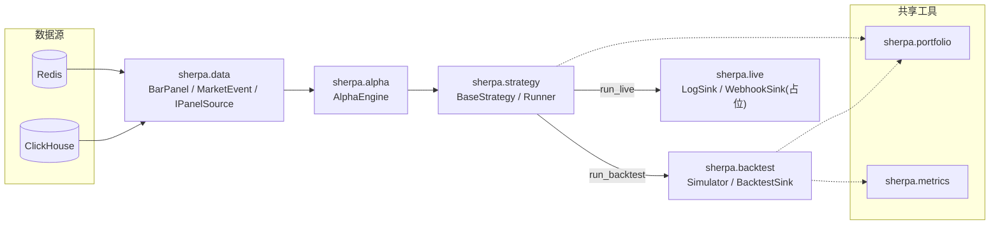

# Sherpa 设计文档

## 1. 定位与边界

Sherpa 是一个 **Data-to-Signal Engine**：

- **输入**：ClickHouse（历史/粗周期归档）+ Redis（1m 实时滑窗与截面通知），由上游 ChomoSyncer-go 写入，字段契约见 [`DATA_CONSUMER_GUIDE.md`](DATA_CONSUMER_GUIDE.md)。
- **输出**：标准化交易意图 `SignalIntent`，交给下游 `ISignalReceiver` 处理。
- **不做**：下单、撮合、仓位对齐、资金清算——这些是下游 Webhooker 的职责，本仓库到"生成信号"为止。
- **硬约束**：同一套策略代码，回测和实盘复用同一个 `on_bar` 循环，差异只体现在数据源（`IPanelSource`）和信号出口（`ISignalReceiver`）上，不允许策略分叉成两份。

## 2. 总体架构



依赖方向：`backtest`/`live` 依赖 `portfolio`/`metrics`；`strategy` 依赖 `backtest`（仅 `BacktestSink`）和 `live`（仅 `LogSink`/`WebhookSink`）；`portfolio`/`metrics` 不反向依赖任何上层模块，可被独立复用。

## 3. `sherpa.data`：数据接入层

### 3.1 `BarPanel`

多时间戳 × 多 symbol 的宽表容器，指标/Alpha 层唯一的输入结构：

| 字段 | 类型 | 说明 |
| :-- | :-- | :-- |
| `interval` | `str` | `"1m"/"5m"/"15m"/"1h"/"4h"/"1d"` |
| `symbols` | `tuple[str,...]` | 列顺序，构造后不变 |
| `open/high/low/close/volume/quote_volume/taker_buy_volume/taker_buy_quote_volume/trades_count`（`PANEL_FIELDS`） | `pd.DataFrame` | index=`start_time`(UTC, 严格单调), columns=`symbols`, dtype=`float64`，**必填、跨 interval 同构** |
| `coverage` | `pd.Series` | 每行"实际到齐symbol数/universe总数" |
| `open_interest`/`open_interest_high`/`open_interest_low`（`OPTIONAL_OI_FIELDS`） | `pd.DataFrame \| None` | **可选**，见下方"OI 字段"一节 |

缺失值如实用 NaN 表示，不做 ffill/插值；`slice()`/`tail()`/`loc_until(t)` 用于窗口截断，可选 OI 字段随之同步切片（为 `None` 时保持 `None`）。

**为什么 OI 是可选字段、不是 `PANEL_FIELDS` 的第 10 个成员**：`PANEL_FIELDS` 这个元组同时驱动了 Redis `kline:{SYM}:1m` 紧凑数组的定长校验（`normalizer._REDIS_ARRAY_LEN`）——如果把 OI 塞进去，1m 场景（Redis 来源、`WindowCache`、几乎所有测试 fixture）就要被迫为一个根本不存在的字段造数据。而 open interest 只存在于 ClickHouse 的 5m 及以上级别（`market.fapi_oi_5m`/`15m`/`1h`/`4h`/`1d`，见 [`DATA_CONSUMER_GUIDE.md`](DATA_CONSUMER_GUIDE.md) §1b "ClickHouse — open interest"），Redis/1m 恒无。所以把它做成 `BarPanel` 上一个独立的、默认 `None` 的可选属性：

- `open_interest`：对齐该 interval 的 `close`（同一个信息可得时点——`fapi_oi_5m` 的 `start_time` 是 K 线开盘时刻，但值是收盘时刻才知道的，等价于 5m K 线的 `close`；15m 及以上直接用 rollup 表的 `sum_open_interest_close`）。
- `open_interest_high`/`open_interest_low`：只有 15m 及以上（rollup 表）才有，5m 原始表没有桶内高低，恒为 `None`。
- 读取方式跟核心字段完全一致——`panel.open_interest` 就是一张普通 `(T, N)` DataFrame，`sherpa.alpha.ops` 里的算子不关心它是不是 `PANEL_FIELDS` 成员，可以直接套用（`rank`/`scale`/`ts_*` 等），因子代码里用法上跟 `panel.close` 是平级的。
- `BarPanel.field(name)` 仍然只认 `PANEL_FIELDS`——`OPTIONAL_OI_FIELDS` 走直接属性访问，不走这个通用口子（避免调用方误以为它跟核心字段一样"保证非 None"）。
- 产出方式：`CHReader.fetch_oi_history()`（无状态 I/O，屏蔽了 5m 原始表与 15m+ rollup 表的列名差异，并对 rollup 表按 `samples` 过滤掉还没收满的最新一桶）+ `ch_long_to_panel(..., oi_df=...)`（按主 kline 面板的 `(index, symbols)` reindex 对齐，缺失如实 NaN，不 ffill）。`HistoricalPanelSource`/`LivePanelSource` 都提供 `include_open_interest`（默认 `False`）开关；`interval="1m"` 时该开关无效，`fetch_oi_history` 直接短路返回空表。

### 3.2 `MarketEvent`

一次"截面就绪"事件的信封：`interval`、`bar_start_time`、`bar_end_time`、`symbols_count`、`coverage_ratio`、`is_cold_start`、`panel`。

```text
bar_end_time = bar_start_time + interval - 1ms   # 对齐 Binance kline close_time 惯例
```

`bar_end_time` 是防前视偏差的权威时间戳：策略在这个时刻才能"看到"这根 bar，回测撮合只能在 `bar_end_time` 之后成交。

### 3.3 组件

| 组件 | 状态 | 职责 |
| :-- | :-- | :-- |
| `CHReader` / `RedisReader` | 无状态 | 纯 I/O，返回原始格式，不做业务转换；`CHReader.fetch_oi_history()`/`has_open_interest()` 是 OI 专用的 I/O（§3.1） |
| `Normalizer`（`ch_long_to_panel`/`redis_window_to_panel`） | 无状态 | 长表/Redis 结构 → `BarPanel` |
| `WindowCache` | 有状态（仅 1m） | 1m 滚动窗口的 seed/append/evict；粗周期无常驻缓存，每次现查 ClickHouse |
| `Universe` | — | symbol 全集 + `as_of(t)` point-in-time 过滤（防幸存者偏差） |

### 3.4 `IPanelSource`：统一驱动接口

```python
class IPanelSource(Protocol):
    def universe(self, as_of=None) -> list[str]: ...
    def __iter__(self) -> Iterator[MarketEvent]: ...
```

`HistoricalPanelSource`（回测，按位置切片保证不看未来）与 `LivePanelSource`（实盘，监听 `stream:market:kline_ready`）是仅有的两个实现，主循环写法完全一致（见 §7.3）。

## 4. `sherpa.alpha`：因子层

### 4.1 `Alpha` 基类

```python
class Alpha:
    name: str = ""
    family: str = "custom"       # "worldquant" | "tradingview" | "custom"
    min_lookback: int = 1          # 保守上界：实际 warmup 可能更短，但不会更长

    def compute(self, panel: BarPanel) -> pd.DataFrame: ...   # (T,N)，与 panel 对齐
    def latest(self, panel: BarPanel) -> pd.Series: ...         # 默认 = compute(panel).iloc[-1]
    qualified_name: str                                            # f"{family}.{name}"
```

一个 `Alpha` 只产出一条分数序列（多输出指标拆成多个单输出子类）；用 `@register_alpha` 注册进全局 `registry`，按 `qualified_name` 查重。

### 4.2 `AlphaEngine`

```python
class AlphaEngine:
    def compute(self, panel) -> pd.DataFrame: ...          # (symbol × alpha名) 截面矩阵，喂给 on_bar
    def compute_history(self, panel) -> dict[str, pd.DataFrame]: ...  # 每个 alpha 的完整历史，研究用
    required_lookback: int                                    # max(所有 alpha.min_lookback)
```

### 4.3 三大家族

| 家族 | 目录 | 状态 |
| :-- | :-- | :-- |
| 世坤101 | `sherpa/alpha/worldquant/` | **101/101 全部落地**，按 `101_alpha_factors_classified.md` 分 5 个子文件夹：`industry`(18，占位)/`price_volume`(28)/`momentum_reversal`(25)/`microstructure`(18)/`composite`(12)。19 个因子（18 个行业类 + Alpha056）因 `BarPanel` 缺行业分类/市值数据，`compute()` 直接 `raise NotImplementedError` |
| TradingView | `sherpa/alpha/tradingview/` | `RSI`、`ATR` 两个打样 |
| Custom | `sherpa/alpha/custom/` | 继承 `CustomAlpha` 写类，或 `@custom_alpha` 装饰函数 |

### 4.4 `ops.py`：算子库

| 类别 | 函数 |
| :-- | :-- |
| 横截面 | `rank`、`scale`、`indneutralize`（占位报错） |
| 时序 | `delay`、`delta`、`ts_sum`、`ts_min`、`ts_max`、`stddev`、`ts_rank`、`ts_argmax`、`ts_argmin`、`ts_corr`、`ts_cov`、`ts_product`、`decay_linear` |
| 逐元素 | `signed_power`、`sign`、`log` |
| 常用子表达式 | `adv(volume, d)`、`vwap(quote_volume, volume)` |

`ts_corr` 对窗口方差趋近 0 的情况做了收口：越界超过 `[-1,1]` `1e-6` 判定为数值不稳定，收口成 NaN，避免 `inf`。三元表达式/布尔当分数的公式统一用 `sherpa/alpha/worldquant/_common.py` 的 `ternary`/`bool_to_signal`，显式处理 NaN 传播。

## 5. `sherpa.portfolio` / `sherpa.metrics`：共享工具层

不依赖 `strategy`/`backtest`，可被研究脚本、未来实盘模块独立复用。

| 模块 | 函数 | 说明 |
| :-- | :-- | :-- |
| `portfolio.weighting` | `demean_l1`、`top_k_long_short`、`equal_weight` | alpha 截面分数 → 目标权重 |
| `portfolio.turnover` | `drift_weights`、`turnover` | 持仓漂移（保持 L1 敞口不变）、换手率 |
| `metrics.factor` | `rank_ic`、`ic_summary`（`ICSummary`）、`quantile_returns`、`is_monotonic_decreasing` | 第一层：RankIC/IC_IR/分位数单调性 |
| `metrics.performance` | `equity_curve`、`annualized_return`、`sharpe_ratio`、`max_drawdown`、`calmar_ratio`、`turnover_decay` | 第二层：绩效指标，只吃收益率序列，来源无关 |

`ic_summary` 对 `std≈0` 区分两种情况：`mean≈0` 时是真 0/0 返回 NaN；`mean` 明显非零（因子极端稳定）时返回 `±inf`，不会把完美因子误判成没有信息量。

## 6. `sherpa.backtest`：回测引擎

两层体系对应 [`backtest_principle.md`](backtest_principle.md)：第一层纯统计检验（无摩擦），第二层仓位映射 + 真实摩擦成本。

| 模块 | 入口 | 用途 |
| :-- | :-- | :-- |
| `alpha_check.py` | `run_alpha_check(alpha_history, forward_returns, ...) -> AlphaCheckResult` | 第一层，单因子 |
| `screening.py` | `screen_alphas(alpha_engine, panel, forward_returns, ...) -> ScreeningReport` | 第一层批量版，自动跳过 `NotImplementedError` 的因子 |
| `vectorized.py` | `run_vectorized_backtest(alpha_history, panel, weighting_fn, cost_model, shift=1) -> BacktestResult` | 第二层，向量化，不依赖 `Runner` |
| `event_driven.py` | `Simulator(prices, cost_model, interval)` | 第二层，事件驱动，`BacktestSink` 唯一持有的对象 |
| `cost_model.py` | `CostModel` 协议、`FixedFeeCostModel`、`ZeroCostModel` | 手续费/滑点，两条第二层路径共用 |
| `result.py` | `AlphaCheckResult`、`BacktestResult` | 结果结构 |

关键点：

- `shift` 是因果律对齐（alpha 在 t 生成，t+1 才生效），跟 `MarketEvent.bar_end_time` 是两层不同的前视偏差保护，都要满足。
- `Simulator` 不能只靠 `on_intents` 算账——`ISignalReceiver` 协议不带价格，价格通过构造参数 `prices` 单独注入。
- 向量化和事件驱动两条路径**必须**共用同一个 `cost_model`、产出同形状的 `BacktestResult`，用于交叉验证（已经用这个方法抓到过一次真实的 bug）。
- `sherpa.backtest` 不 import `sherpa.strategy` 任何东西；`event_driven.TargetIntent` 是本地定义的结构化 `Protocol`，不是 `SignalIntent`。

## 7. `sherpa.strategy`：策略编排层

### 7.1 契约

```python
@dataclass(frozen=True)
class TargetPosition:
    weights: Mapping[str, float]           # symbol -> 目标仓位百分比

@dataclass(frozen=True)
class SignalIntent:
    event_id, strategy_id, symbol, signal_type, target_percent, bar_end_time, generated_at
```

```python
class BaseStrategy:
    strategy_id: str = ""                  # 默认取类名
    def setup(self) -> None: ...
    def on_bar(self, event: MarketEvent, features: pd.DataFrame) -> TargetPosition: ...
```

### 7.2 `Runner`

```python
class Runner:
    def __init__(self, strategy, alpha_engine, sink): ...
    def run(self, panel_source: IPanelSource) -> None: ...
    def run_backtest(self, panel_source) -> None: ...   # = run()
    def run_live(self, panel_source) -> None: ...        # = run()
```

主循环（`run_backtest`/`run_live` 是同一份实现，不允许分叉）：

```python
for event in panel_source:
    features = alpha_engine.compute(event.panel)
    target = strategy.on_bar(event, features)
    intents = self._to_intents(event, target)   # 补 event_id/generated_at，标准化
    sink.submit(intents)
```

### 7.3 `sink/`：下游对接

| 实现 | 状态 | 行为 |
| :-- | :-- | :-- |
| `LogSink` | 可用 | 调 `sherpa.live.build_live_requests`，落日志，充当 paper trading |
| `BacktestSink` | 可用 | 薄转发层，把 `intents` 转给构造时注入的 `Simulator`，自己不含业务逻辑 |
| `WebhookSink` | **占位未实现** | `submit()` 直接 `raise NotImplementedError`，等 Webhooker 接口定稿 |

## 8. `sherpa.live`：实盘派发前处理

只处理"已经决定好的信号怎么打包成可派发的形状"，**不改变任何决策数字**：

```python
def build_live_requests(intents: Sequence[SignalIntentLike]) -> list[LiveOrderRequest]: ...

@dataclass(frozen=True)
class LiveOrderRequest:
    idempotency_key: str        # f"{strategy_id}:{bar_end_time.isoformat()}:{symbol}"，确定性，不是随机 UUID
    strategy_id, symbol, target_percent, bar_end_time, generated_at, dispatched_at
```

**边界（已拍板，不在 v1 范围内）**：仓位再平衡阈值这类"要不要发信号"的判断（会改变决策结果）不属于 `sherpa.live`——这类逻辑如果将来要做，必须挂在 `Runner` 主循环里对所有 sink/driver 一视同仁的共享阶段，否则回测和实盘会跑出两条不同的仓位路径。目前没有具体需求，不实现。

实盘清算/PnL 展示是下游 Webhooker 的职责，Sherpa 不接收成交回报，也不维护实盘持仓/资金状态。

## 9. 落地状态

| 模块 | 状态 |
| :-- | :-- |
| `sherpa.data` | 完成，含真实 ClickHouse/Redis 烟雾测试 |
| `sherpa.alpha` | 完成（世坤101 全量 + TradingView 打样 + Custom） |
| `sherpa.portfolio` / `sherpa.metrics` | 完成 |
| `sherpa.backtest`（向量化 + 事件驱动 + 筛选） | 完成 |
| `sherpa.strategy`（`BaseStrategy`/`Runner`/`LogSink`/`BacktestSink`） | 完成 |
| `sherpa.live` | 部分完成，仅 `build_live_requests`，仓位再平衡/风控未实现 |
| `WebhookSink` / 实盘对接 | **未实现**，等下游 Webhooker |
| 世坤101因子的真实数据验证（`research/alpha_research/worldquant_101/`） | 进行中，多数因子尚未在真实数据上通过第一层检验 |

## 10. 相关文档

| 文档 | 内容 |
| :-- | :-- |
| [`DATA_CONSUMER_GUIDE.md`](DATA_CONSUMER_GUIDE.md) | 上游 ClickHouse/Redis 字段契约 |
| [`backtest_principle.md`](backtest_principle.md) | 两层回测体系的数学原理 |
| `examples/` | 合成数据教学示例 |
| `research/alpha_research/worldquant_101/` | 真实 ClickHouse 数据的因子研究项目 |
