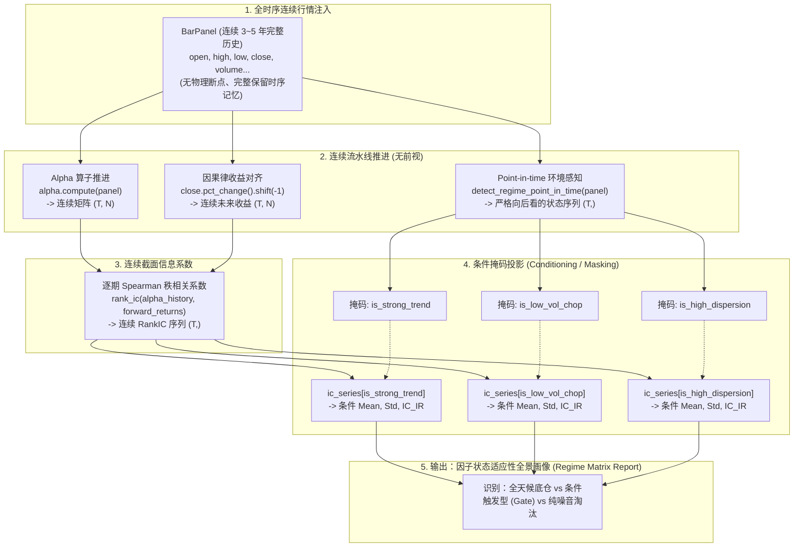

# 工业级 Alpha 因子在不同 Regime 下的测评工作流规范

> 本文档阐述工业级量化对冲基金（Quant Hedge Funds）如何科学、无前视泄露地在不同市场状态（Market Regime）下评估与筛选 Alpha 因子的标准工程工作流（Workflow）。

---

## 目录
1. [核心方法论与设计哲学](#1-核心方法论与设计哲学)
2. [为什么绝不能做“物理数据切片”？（四大致命暗礁）](#2-为什么绝不能做物理数据切片四大致命暗礁)
3. [工业级全时序条件测评架构图](#3-工业级全时序条件测评架构图)
4. [因果律红线：Point-in-time（点在时间）打标规范](#4-因果律红线point-in-time点在时间打标规范)
5. [完整实施步骤与 Python 参考代码](#5-完整实施步骤与-python-参考代码)
   - [步骤 1：连续行情与全时序 Alpha 特征矩阵](#步骤-1连续行情与全时序-alpha-特征矩阵)
   - [步骤 2：严格向后看（Point-in-time）的 Regime 打标](#步骤-2严格向后看point-in-time的-regime-打标)
   - [步骤 3：连续逐期 RankIC 序列计算](#步骤-3连续逐期-rankic-序列计算)
   - [步骤 4：条件掩码投影与多维画像统计](#步骤-4条件掩码投影与多维画像统计)
   - [步骤 5：跨状态动态切换摩擦成本检验](#步骤-5跨状态动态切换摩擦成本检验)
6. [因子状态决策矩阵：如何应用测评结果？](#6-因子状态决策矩阵如何应用测评结果)

---

## 1. 核心方法论与设计哲学

在评估 Alpha 因子时，工业界的核心指导原则是：
> **“计算全时序连续推进，评估按条件掩码投影（Continuous Computation & Point-in-time Masking Evaluation）。”**

* **时序推进（Computation）必须是物理连续的**：行情数据与因子计算沿着真实物理时间轴不间断流动，确保时序状态、指数移动平均、滚动窗口平滑过渡，不产生任何人为物理断裂。
* **效果评估（Evaluation）是条件分布的**：在全局不间断计算出的连续检验指标（如逐期 `RankIC`）上，套用**严格在时间发生时刻确立的 Regime 掩码**进行条件期望与分布统计。

---

## 2. 为什么绝不能做“物理数据切片”？（四大致命暗礁）

很多初学者容易产生一种直觉：“既然分了牛市、熊市和震荡市，我把这几段数据从数据库里分别截出来，当成 3 个独立的行情包丢进回测系统分别跑不就行了吗？”

这种物理切片（Physical Slicing）的做法在严肃量化研究中是**绝对被禁止的**，它会带来以下四大毁灭性暗礁：

### 2.1 时序断裂与冷启动缺失（Cold Start Truncation）
许多经典因子具有较长的记忆周期（如布林带、ATR、世坤 Alpha036 的 `decay_linear(200)` 等）。
* 若把某一段 3 个月的“震荡市”硬生生切出来从第 1 根开始计算：
  * 前 60~200 根 Bar 的 Alpha 值将全部为 `NaN`；
  * 割裂了跨越前序环境时积累的动量与价格记忆，造成因子在断点附近严重失真。

### 2.2 后视镜打标前视泄露（Hindsight Lookahead Leakage）
* 你在 2026 年复盘时，知道“2024-03-15 是牛市高点，随后进入了 6 个月的震荡洗盘”。
* 但如果直接以这一天作为分界线切断数据，就等于在回测里**给策略开了后视镜**：策略在 2024-03-14 还能做多，2024-03-15 就突然知道“换状态了”。真实世界中没有敲钟通知，状态切换是充满滞后与不确定的。

### 2.3 状态切换摩擦盲区（Regime Switching Turnover Blindspot）
* 因子 A 在纯震荡市年化 40%，因子 B 在纯单边市年化 50%。如果孤立分段测试，两个因子的净值曲线都极其优美。
* **但一旦上线合体，策略往往暴毙**：因为从“震荡”跳变到“趋势”的瞬间，持仓必须从“做空强势币”瞬间反转为“追涨强势币”，产生接近 **200% 的单期暴力全仓换手**。分段回测完全漏掉了这笔致命的调仓摩擦与滑点冲击损耗。

### 2.4 小样本统计过拟合（Data Snooping in Small Subsamples）
将数据物理切成许多细碎的碎片后，某些极端状态可能只有几百根 Bar。在如此微小的样本集上做多因子排序很容易因为纯统计巧合（随机噪音）跑出极高的 IC，误将巧合当作有效 Alpha。

---

## 3. 工业级全时序条件测评架构图



---

## 4. 因果律红线：Point-in-time（点在时间）打标规范

整套方法论的核心基石是：**在 $t$ 时刻生成的 Regime 标签，必须仅且仅使用 $\le t$ 的已知历史信息。**

### ❌ 错误示范：带有未来分布信息的全局打标
```python
# 致命前视：用全量 5 年历史数据一次性计算 75% 成交量分位数
# 使得系统在 2021 年就提前“预知”了 2024 年大牛市的成交量天花板！
global_threshold = panel.quote_volume.sum(axis=1).quantile(0.75)
regime_mask = panel.quote_volume.sum(axis=1) > global_threshold
```

### ✅ 正确示范：严格时序向后看的滚动分位数打标
```python
# 正确：在时刻 t，仅基于过去 90 天（如 540 根 4h bar）的滚动窗口评估当前位置
# 每一根 bar 上的打标，都是当时市场参与者在客观物理时间截面上唯一能掌握的真实信息
rolling_rank = panel.quote_volume.sum(axis=1).rolling(540).rank(pct=True)
regime_mask = rolling_rank > 0.75
```

---

## 5. 完整实施步骤与 Python 参考代码

本套流程可直接在 Sherpa 的 `research` 模块下无缝运行：

### 步骤 1：连续行情与全时序 Alpha 特征矩阵
```python
from sherpa.data.schema import BarPanel
from sherpa.alpha.base import Alpha

def compute_continuous_signals(alpha: Alpha, panel: BarPanel) -> pd.DataFrame:
    """全时序计算因子得分，保留全部时序平滑性。"""
    return alpha.compute(panel)  # 输出形状: (T, N)
```

### 步骤 2：严格向后看（Point-in-time）的 Regime 打标
```python
import pandas as pd

def generate_point_in_time_regimes(panel: BarPanel, lookback: int = 540) -> pd.DataFrame:
    """生成对齐于 panel.index 的状态布尔掩码表。"""
    returns = panel.close.pct_change()
    
    # 1. 趋势广度 (Market Breadth): 过去 1 根 bar 上涨币种比例
    breadth = (returns > 0.0).mean(axis=1)
    btc_trend = panel.close["BTCUSDT"] > panel.close["BTCUSDT"].rolling(60).mean()
    is_trend_bull = btc_trend & (breadth > 0.60)
    is_trend_bear = (~btc_trend) & (breadth < 0.40)
    
    # 2. 波动率分位数 (Realized Volatility Rank)
    market_rv = returns.rolling(24).std().mean(axis=1)
    rv_rank = market_rv.rolling(lookback).rank(pct=True)
    is_high_vol = rv_rank > 0.75
    is_low_vol = rv_rank < 0.25
    
    # 3. 截面收益离散度 (Dispersion Rank)
    dispersion = returns.std(axis=1)
    disp_rank = dispersion.rolling(lookback).rank(pct=True)
    is_high_dispersion = disp_rank > 0.70
    
    return pd.DataFrame({
        "trend_bull": is_trend_bull,
        "trend_bear": is_trend_bear,
        "high_vol": is_high_vol,
        "low_vol": is_low_vol,
        "high_dispersion": is_high_dispersion,
        "chop": (breadth >= 0.40) & (breadth <= 0.60) & is_low_vol,
    }, index=panel.index)
```

### 步骤 3：连续逐期 RankIC 序列计算
```python
from sherpa.metrics.factor import rank_ic

# 未来 1 期收益率（严格 shift(-1) 对齐因果律）
forward_returns = panel.close.pct_change().shift(-1)

# 全量连续 RankIC 序列 (T,)
ic_series = rank_ic(alpha_history, forward_returns)
```

### 步骤 4：条件掩码投影与多维画像统计
```python
from sherpa.metrics.factor import ic_summary

def evaluate_conditional_alpha(ic_series: pd.Series, regimes: pd.DataFrame) -> pd.DataFrame:
    """对各状态掩码切片分别计算信噪比。"""
    report_rows = {}
    
    # 1. 全局无条件基线
    baseline = ic_summary(ic_series)
    report_rows["ALL (Baseline)"] = {
        "samples": int(ic_series.dropna().shape[0]),
        "ic_mean": baseline.mean,
        "ic_std": baseline.std,
        "ic_ir": baseline.ic_ir,
        "win_rate": float((ic_series > 0).mean()),
    }
    
    # 2. 逐个 Regime 条件统计
    for regime_name in regimes.columns:
        mask = regimes[regime_name]
        cond_ic = ic_series[mask]
        summary = ic_summary(cond_ic)
        report_rows[regime_name] = {
            "samples": int(cond_ic.dropna().shape[0]),
            "ic_mean": summary.mean,
            "ic_std": summary.std,
            "ic_ir": summary.ic_ir,
            "win_rate": float((cond_ic > 0).mean()),
        }
        
    return pd.DataFrame.from_dict(report_rows, orient="index")
```

### 步骤 5：跨状态动态切换摩擦成本检验
对于根据 Regime 动态切换因子的组合策略，在第二层回测中必须让 [`sherpa.backtest.event_driven.Simulator`](file:///d:/code-repo/Chomo/Sherpa/sherpa/backtest/event_driven.py#L34-L100) 连续走完整条历史。
* 重点检验：**换手衰减率（Turnover Decay）** 与 **扣费后净 Sharpe 比率**；
* 若毛收益极高但扣费后净值平缓，说明跨状态跳变产生的手续费吃光了利润，必须在策略层引入**状态迟滞缓冲区（Hysteresis Buffer）**或**动态平滑过渡权重**。

---

## 6. 因子状态决策矩阵：如何应用测评结果？

完成上述测评后，每个因子将获得一张多维体检表。根据体检结果，因子将被分配到以下四种工业部署路径：

| 因子测评画像特征 | 工业定性分类 | 策略落地与实战执行建议 |
| :--- | :--- | :--- |
| **全环境 IC_IR 稳定 $\ge 0.15$，单调性良好** | **全天候核心底仓 (All-Weather Core)** | 赋予组合固定底仓权重，无需设置环境前置开关。 |
| **高离散/强趋势下 IC_IR $\ge 0.35$，但在震荡市 IC 钝化或轻微回撤** | **条件进攻型因子 (Conditional Aggressive)** | **必须加装门控（Gate）**：仅在 `high_dispersion` 或 `trend_bull` 触发时激活权重，其余时间归零断电。 |
| **窄幅震荡下 IC_IR $\ge 0.30$，但单边趋势中发生大亏** | **均值回归套利型 (Mean Reversion)** | 仅在 `low_vol & chop` 状态下通电，一旦趋势突破立即强制止损平仓。 |
| **特定环境下 IC 稳定显著为负（如 IC 均值 $\approx -0.06$）** | **反向镜面因子 (Inverted Alpha)** | 公式直接乘以 $-1.0$，反向利用错误定价捕获超额。 |
| **所有环境下 IC_IR 均 $< 0.08$ 或正负剧烈混乱摆动** | **无价值纯噪音 (Toxic Alpha)** | **直接永久废弃**，禁止进入后续任何组合优化环节。 |

