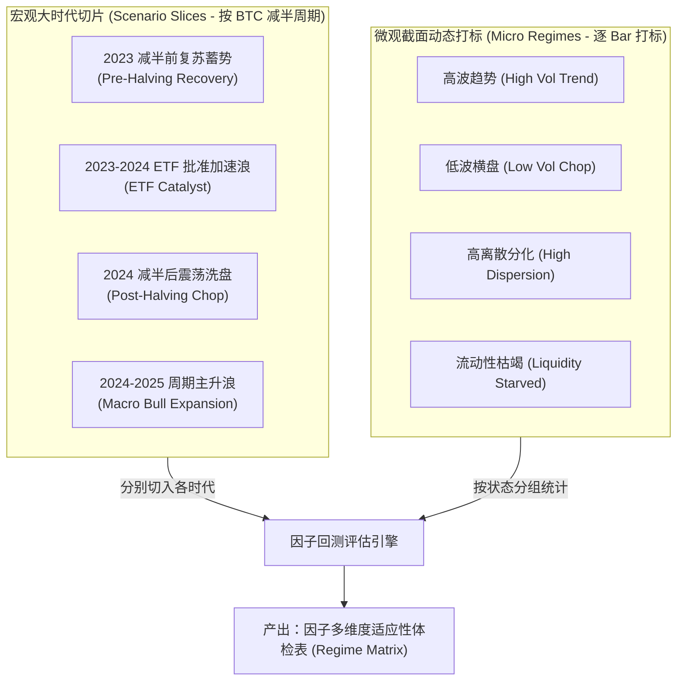

# 量化市场状态（Market Regime）分类与研究指导准则

> 本文档为 Sherpa 量化研究框架（`research` 模块）的顶层指导规范，用于规范因子评估、历史回测切片、以及实盘市场状态感知（Regime Sensing）。

---

## 目录
1. [传统金融（TradFi）四大经典 Regime 体系](#1-传统金融tradfi四大经典-regime-体系)
2. [TradFi 与 Crypto 对应指标 1 对 1 映射总表](#2-tradfi-与-crypto-对应指标-1-对-1-映射总表)
3. [从金融原理到 Sherpa 的代码落地](#3-从金融原理到-sherpa-的代码落地)
   - [3.1 趋势与方向（Trend & Direction）](#31-趋势与方向trend--direction)
   - [3.2 波动率环境（Volatility Regime）](#32-波动率环境volatility-regime)
   - [3.3 离散度与相关性（Dispersion & Correlation）](#33-离散度与相关性dispersion--correlation)
   - [3.4 流动性与活跃度（Liquidity & Activity）](#34-流动性与活跃度liquidity--activity)
4. [加密货币专属特化维度：杠杆率与微观资金费率（Leverage & Funding）](#4-加密货币专属特化维度杠杆率与微观资金费率leverage--funding)
5. [宏观与微观双层研究框架指导准则](#5-宏观与微观双层研究框架指导准则)
   - [5.1 宏观层：BTC 减半 4 年大周期情景切片（Scenario Slices）](#51-宏观层btc-减半-4-年大周期情景切片scenario-slices)
   - [5.2 微观层：截面状态动态打标与因子适应性画像](#52-微观层截面状态动态打标与因子适应性画像)
   - [5.3 因子研发与筛选工作流 SOP](#53-因子研发与筛选工作流-sop)

---

## 1. 传统金融（TradFi）四大经典 Regime 体系

在现代多因子模型与量化对冲基金（如 AQR、Two Sigma、WorldQuant）中，市场状态并不是随机混沌的，而是由四个**相互正交（物理上相互独立）的核心维度**所决定：

```
                 ┌──────────────────────────────────────────────┐
                 │          传统量化四大 Regime 评估维度          │
                 └──────┬──────────────┬──────────────┬─────────┘
                        │              │              │
          ┌─────────────▼──┐    ┌──────▼──────┐ ┌─────▼──────────┐ ┌──────────────▼───┐
          │ 1. 趋势方向    │    │ 2. 波动率   │ │ 3. 市场离散度  │ │ 4. 市场流动性    │
          │ (Trend)        │    │ (Volatility)│ │ (Dispersion)   │ │ (Liquidity)      │
          └────────────────┘    └─────────────┘ └────────────────┘ └──────────────────┘
```

### 1.1 趋势与方向（Trend & Direction）
* **物理本质**：全市场是否存在持续的宏观资本单边流入或流出？大盘的动量动能处于何种状态？
* **传统指标**：标普 500 指数均线系统（MA50 / MA200）、ADX（平均趋向指标）、Donchian 通道突破比率、上涨/下跌线（Advance-Decline Line）。
* **对策略的影响**：
  * **强趋势市（Strong Trend）**：时序动量（TS Momentum）与突破策略极强；反转类因子（Reversal）极易逆势受损甚至爆仓。
  * **无趋势震荡市（Range-bound / Chop）**：动量策略频繁假突破造成两边被抽脸；均值回归（Mean Reversion）与统计套利策略胜率最高。

### 1.2 波动率环境（Volatility Regime）
* **物理本质**：市场多空博弈的激烈程度与不确定性溢价（Risk Premium）。
* **传统指标**：VIX 恐慌指数（期权隐含波动率）、标普 ATR 相对历史分位数、高频已实现波动率（Realized Volatility）。
* **对策略的影响**：
  * **高波动环境（High Vol）**：点差扩大、滑点剧增、价格位移迅速，因子的信噪比往往两极分化，需要严格收缩仓位杠杆并放大止损空间。
  * **低波动环境（Low Vol）**：市场沉闷、成交平淡，网格交易与 Carry/套利策略占据主导。

### 1.3 市场离散度与相关性（Cross-sectional Dispersion & Correlation）
* **物理本质**：**这是所有截面多因子选币/选股策略（包括世坤 101 因子）最底层的超额收益来源！**
  * 若全市场所有标的明日同涨 1%，标的间收益方差为 0，无论排序模型多完美，多头与空头的超额对冲收益必定为 0，扣除手续费必亏。
  * 若市场出现结构性行情，部分赛道大涨 15%，部分阴跌 5%，截面离散度极高，排序好的因子即可获取巨大超额。
* **传统指标**：成分股收益截面标准差（Cross-sectional Standard Deviation）、隐含相关性指数（Cboe Implied Correlation Index）。
* **对策略的影响**：
  * **高离散度（High Dispersion）**：多空截面 Alpha 的黄金收割期。
  * **高相关性 / 低离散（High Correlation）**：系统性 Beta 主导全场（一损俱损、一荣俱荣），选币 Alpha 大面积失效。

### 1.4 流动性与活跃度（Liquidity & Activity）
* **物理本质**：二级市场承载大额交易的深度容量与微观换手摩擦阻力。
* **传统指标**：交易所总成交金额、换手率（Turnover Ratio）、做市商挂单簿深度（Orderbook Depth）、买卖价差（Bid-Ask Spread）。
* **对策略的影响**：
  * **高流动性充沛期**：市场容量大，高换手率因子（如 5m/15m 频繁调仓）可顺畅执行。
  * **流动性枯竭期（Liquidity Vacuum）**：深度极薄，冲击成本剧烈上升，高换手因子会被交易摩擦完全蚕食，系统必须强制降频。

---

## 2. TradFi 与 Crypto 对应指标 1 对 1 映射总表

金融第一性原理在二级市场完全通用。下表将传统金融的经典考量，严格投影到加密货币市场的特征与 Sherpa 现有数据体系中：

| 传统金融维度 (TradFi Regime) | 金融物理本质 (第一性原理) | TradFi 经典实现 (美股/商品) | Crypto 对应观测指标 (基于 Sherpa `BarPanel`) | 状态划分标准 (建议阈值) |
| :--- | :--- | :--- | :--- | :--- |
| **1. 趋势与方向**<br>*(Trend / Direction)* | 宏观动能方向与全市场普涨/普跌程度 | S&P 500 MA200、ADX、A/D 涨跌线 | **① BTC 均线与收益动量**<br>**② 市场广度 (Market Breadth)**：截面上涨币种占比 | **强牛**：BTC > MA60 且 Breadth > 0.65<br>**强熊**：BTC < MA60 且 Breadth < 0.35<br>**震荡**：Breadth 在 0.40 ~ 0.60 徘徊 |
| **2. 波动率环境**<br>*(Volatility)* | 市场博弈激烈程度与风险溢价 | VIX 指数、ATR 历史分位数 | **① BTC / 全市场已实现波动率 (RV)**<br>**② 全市场平均 ATR 滚动分位数** | **高波 (High Vol)**：历史分位数 > 75%<br>**常态 (Normal Vol)**：分位数 25% ~ 75%<br>**低波 (Low Vol)**：历史分位数 < 25% |
| **3. 离散度与相关性**<br>*(Dispersion & Correlation)* | 资产走势分化程度（**Alpha 超额生命线**） | 标普成分股截面方差、Cboe 隐含相关性 | **① 截面收益离散度 (Cross-sectional Dispersion)**<br>**② 各币种与 BTC 的平均截面相关系数** | **山寨季 / 分化**：Dispersion 处于高分位 (> 70%)<br>**系统性吸血/暴跌**：Dispersion 处于低分位，平均相关性 > 0.85 |
| **4. 流动性与活跃度**<br>*(Liquidity & Activity)* | 资金深度容量与微观换手摩擦 | 纽交所成交额、换手率、盘口价差 | **① 全市场截面成交总额 ($\sum \text{quote\_volume}$)**<br>**② 全市场主动买卖倾斜度 (Taker Buy Ratio)** | **高流动性**：成交额滚动分位数 > 75%<br>**流动性荒漠**：成交额滚动分位数 < 25%<br>**多头挤压**：Taker Ratio > 0.53 |

---

## 3. 从金融原理到 Sherpa 的代码落地

基于 Sherpa 的 [`BarPanel`](file:///d:/code-repo/Chomo/Sherpa/sherpa/data/schema.py#L57-L138) 数据结构，利用其 2D DataFrame 矩阵属性，上述指标均可实现纯向量化秒级计算：

### 3.1 趋势与方向（Trend & Direction）
通过结合“大盘锚点（BTC）”与“全市场微观广度”识别真实趋势，杜绝“BTC 独立吸血、山寨全跌”的伪牛市假象：

```python
import pandas as pd
from sherpa.data.schema import BarPanel

def compute_trend_regime(panel: BarPanel, ma_period: int = 60) -> pd.DataFrame:
    # 1. BTC 动量与大盘基准
    btc_close = panel.close["BTCUSDT"]
    btc_ma = btc_close.rolling(ma_period).mean()
    btc_trend_up = btc_close > btc_ma
    
    # 2. 全市场广度：当前截面上收盘价涨幅大于 0 的币种占比 (0.0 ~ 1.0)
    period_returns = panel.close.pct_change()
    market_breadth = (period_returns > 0.0).mean(axis=1)
    
    # 3. 综合状态判定
    is_strong_bull = btc_trend_up & (market_breadth > 0.65)
    is_strong_bear = (~btc_trend_up) & (market_breadth < 0.35)
    
    return pd.DataFrame({
        "btc_trend_up": btc_trend_up,
        "market_breadth": market_breadth,
        "is_strong_bull": is_strong_bull,
        "is_strong_bear": is_strong_bear,
    }, index=panel.index)
```

### 3.2 波动率环境（Volatility Regime）
基于各标的收益率的时序标准差聚合，评估全市场当前的真实波动环境：

```python
def compute_volatility_regime(panel: BarPanel, window: int = 24, rolling_quantile_window: int = 540) -> pd.DataFrame:
    # 1. 逐币种计算过去 N 根 bar 的滚动已实现波动率 (Realized Volatility)
    returns = panel.close.pct_change()
    per_symbol_rv = returns.rolling(window).std()
    
    # 2. 截面平均：代表全市场当前的平均微观波动强度
    market_rv = per_symbol_rv.mean(axis=1)
    
    # 3. 滚动历史分位数 (如 90 天 4h 周期约为 540 根)
    rv_rank = market_rv.rolling(rolling_quantile_window).rank(pct=True)
    
    is_high_vol = rv_rank > 0.75
    is_low_vol = rv_rank < 0.25
    
    return pd.DataFrame({
        "market_rv": market_rv,
        "rv_quantile": rv_rank,
        "is_high_vol": is_high_vol,
        "is_low_vol": is_low_vol,
    }, index=panel.index)
```

### 3.3 离散度与相关性（Dispersion & Correlation）
直接在单截面上沿 `axis=1` 计算横向标准差，实时观测截面 Alpha 的有效性土壤：

```python
def compute_dispersion_regime(panel: BarPanel, rolling_window: int = 540) -> pd.DataFrame:
    # 1. 每一个时间戳 t 上，所有非缺失币种收益率的横向标准差
    returns = panel.close.pct_change()
    dispersion = returns.std(axis=1)
    
    # 2. 离散度历史分位数
    disp_rank = dispersion.rolling(rolling_window).rank(pct=True)
    
    # 3. 截面多因子策略甜蜜期（高分化状态）
    is_alpha_friendly = disp_rank > 0.70
    
    return pd.DataFrame({
        "dispersion": dispersion,
        "dispersion_quantile": disp_rank,
        "is_alpha_friendly": is_alpha_friendly,
    }, index=panel.index)
```

### 3.4 流动性与活跃度（Liquidity & Activity）
利用 ClickHouse 写入的 `quote_volume`（USDT 成交额）与 `taker_buy_quote_volume`（主动吃单额）：

```python
def compute_liquidity_regime(panel: BarPanel, rolling_window: int = 540) -> pd.DataFrame:
    # 1. 全市场截面总成交额 (USDT)
    total_quote_vol = panel.quote_volume.sum(axis=1)
    vol_rank = total_quote_vol.rolling(rolling_window).rank(pct=True)
    
    # 2. 主动买单成交占比 (Taker Buy Ratio)
    total_taker_buy = panel.taker_buy_quote_volume.sum(axis=1)
    taker_buy_ratio = total_taker_buy / total_quote_vol
    
    is_high_liquidity = vol_rank > 0.75
    is_liquidity_starved = vol_rank < 0.25
    
    return pd.DataFrame({
        "total_volume": total_quote_vol,
        "volume_quantile": vol_rank,
        "taker_buy_ratio": taker_buy_ratio,
        "is_high_liquidity": is_high_liquidity,
        "is_liquidity_starved": is_liquidity_starved,
    }, index=panel.index)
```

---

## 4. 加密货币专属特化维度：杠杆率与微观资金费率（Leverage & Funding）

除了传统四大维度，加密永续合约市场最根本的微观区别是：**24/7 高杠杆与资金费率清算机制（Liquidations / Squeezes）**。

这是在 TradFi 体系之上的**第五个专属补充维度（Leverage Regime）**：

### 4.1 核心观察指标
1. **全市场加权资金费率（Market Aggregated Funding Rate）**：
   * 永续合约每 8 小时结算一次。做多过多时费率为正（多付空），做空过多时费率为负（空付多）。
2. **全市场持仓总量变动（Aggregated Open Interest, OI Change）**：
   * 价格上涨 + OI 暴增 = 真实杠杆资金推升；
   * 价格下跌 + OI 骤降 = 多头清算爆仓踩踏（Long Squeeze Cascade）。

### 4.2 状态判定准则
* **杠杆极度亢奋期（Euphoric Leverage / Long Squeeze Risk）**：
  * **特征**：加权资金费率年化 $> 40\%$，全市场成交额与 OI 创近期新高。
  * **指示**：市场多头拥挤，脆弱性极高，极易因为微小的下跌触发连锁强制平仓瀑布。此时做多因子的半衰期骤降，逆势摸顶策略盈亏比提升。
* **恐慌负费率期（Extreme Fear / Short Squeeze Fuel）**：
  * **特征**：资金费率严重为负（年化 $< -25\%$），现货基差贴水。
  * **指示**：全市场拥挤做空，随时成为现货大单暴力轧空（Short Squeeze）的燃料包。突破空头因子的假突破概率大幅增加。
* **健康现货驱动期（Neutral / Spot-Driven）**：
  * **特征**：资金费率保持在基础年化（$5\% \sim 10\%$ 正常水平），价格平稳。
  * **指示**：技术面与量价因子（世坤 101）最少受到无序清算噪音打扰的稳定期。

---

## 5. 宏观与微观双层研究框架指导准则

为了防止在 `research` 模块中“拍脑袋拉一段数据”造成失真，建议建立**“宏观情景切片 + 微观动态打标”**的双层回测 SOP：



### 5.1 宏观层：BTC 减半 4 年大周期情景切片（Scenario Slices）
在做样本外测试（Out-of-Sample）与压力测试时，把历史按宏观大时代拆分成标准字典切片（在 `research/alpha_research/worldquant_101/data.py` 中规范）：

```python
# 推荐的标准测试切片（以最近一轮周期为例）
HISTORICAL_REGIME_SLICES = {
    "PRE_HALVING_BEAR_BOTTOM":   ("2022-11-01", "2023-09-30"),  # 深熊筑底期 (低流动性、极度悲观)
    "PRE_HALVING_ETF_RUN":        ("2023-10-01", "2024-03-31"),  # 减半前冲刺 (ETF驱动、BTC独立吸血)
    "POST_HALVING_CHOP_WASHOUT":  ("2024-04-01", "2024-10-31"),  # 减半后垃圾时间 (高位大洗盘、多空两抽)
    "POST_HALVING_ALT_EXPANSION": ("2024-11-01", "2025-06-30"),  # 减半后繁荣期 (山寨普涨、高离散度)
}
```
* **评估原则**：一个合格的生产级策略，不要求在每个切片都赚大钱，但**绝不允许在某个典型切片出现毁灭性穿仓**（例如动量策略在洗盘期回撤 $> 50\%$）。必须明确掌握因子在各个时代的盈亏特征。

### 5.2 微观层：截面状态动态打标与因子适应性画像
运行 [`run_alpha_check`](file:///d:/code-repo/Chomo/Sherpa/sherpa/backtest/alpha_check.py#L12-L38) 时，除了输出全局标量，应当按微观状态分组计算 `RankIC` 与 `IC_IR`，生成因子的**“适应性画像（Regime Profile）”**：

#### 因子多维度评估报告示例模板

| Alpha 因子 | 全局 IC_IR | 强趋势市 (Trend) | 窄幅震荡 (Chop) | 高离散度 (Dispersion) | 流动性枯竭 (Starved) | 因子体质定性与实盘建议 |
| :--- | :---: | :---: | :---: | :---: | :---: | :--- |
| **Alpha_A** (突破动量型) | 0.11 | **0.42** | -0.21 | **0.35** | -0.15 | **强趋势/高离散适应型**。震荡市必须关停，禁止全天候开启。 |
| **Alpha_B** (成交量反转型) | 0.08 | -0.18 | **0.38** | 0.05 | **0.31** | **震荡/低流动性套利型**。大盘单边暴拉时必须休眠。 |
| **Alpha_C** (基本面稳健型) | **0.25** | 0.28 | 0.22 | 0.29 | 0.18 | **全天候抗周期底仓**。适合作为核心组合的固定权重。 |

### 5.3 因子研发与筛选工作流 SOP

1. **第一步（宏观大筛）**：
   在 1~2 个完整的减半周期（约 4 年）历史数据上运行初筛。由于跨周期混合，全局 `IC_IR` 门槛可放宽至 `0.10 ~ 0.15`，目的仅在于剔除**全周期无信息含量的纯随机噪音**。
2. **第二步（微观切片诊断）**：
   对初筛通过的因子，注入本指南第 3 节的四个微观状态标签，计算各状态下的条件 RankIC。
3. **第三步（确定激活条件 Gate）**：
   若因子表现出强烈的状态偏好（如仅在高离散度下暴利），将其标记为**条件 Alpha（Conditional Alpha）**，在策略层的 [`BaseStrategy.on_bar`](file:///d:/code-repo/Chomo/Sherpa/sherpa/strategy/base.py#L27-L29) 中设置对应状态的前置触发门槛（Gate），而非盲目全天候重仓。

