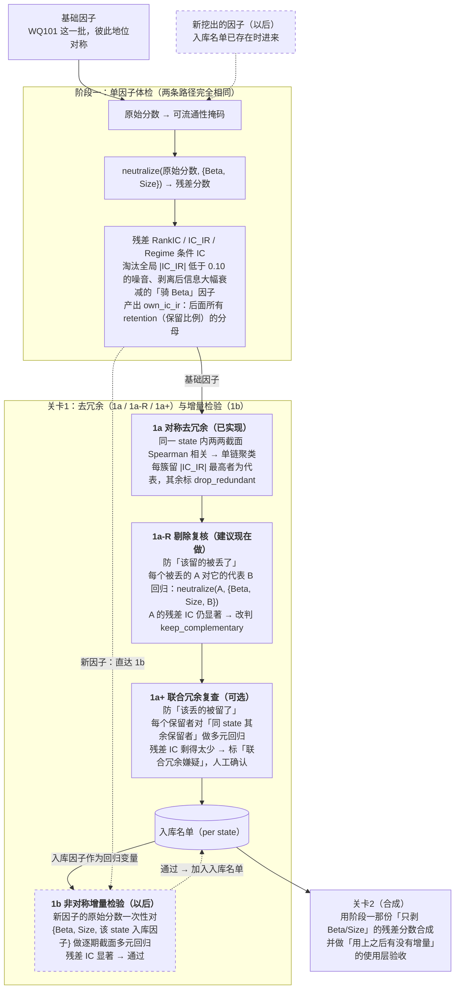

# 关卡1 全貌与待办：从「两两去冗余」到「增量检验」

> 本文是 [`README.md`](README.md)（关卡1 现有实现）的补充，不改变现有流程，只回答三件事：
> 在"以后会不断有新因子进来"的前提下，关卡1 **还缺什么**、**哪些现成的函数和流程可以直接复用**、
> **需要新增哪些函数和流程**，以及每一项**什么时候该做**。
>
> 背景讨论见 [`docs/factor_mining_landscape.md`](../../docs/factor_mining_landscape.md) §0.3（验证漏斗）、
> §3.2（残差适应度）、§11.3（增量检验）。

---

## 0. 一句话结论

- **不论基础因子还是新挖出的因子，第一步都一样**：先过阶段一体检（剥离 Beta + Size 后算残差 IC）。
  阶段一不因为"有没有入库名单"而改变，它只回答"这个因子本身有没有选币能力"。
- **现在**（WQ101 这一批因子地位对称，还没有"已入库"的概念）：关卡1 用现有的**两两相关聚类去冗余**，
  再补一道低成本的**剔除复核**（防止误杀互补因子）就够了。
- **以后**（第一次产出入库名单之后，再有新因子进来）：新因子通过阶段一后，还要再过一道**增量检验**：
  把它的**原始分数**对"Beta + Size + 该 state 下全部已入库因子"**一次性**做逐期截面多元回归，看残差还有没有预测力。
- 增量检验**不需要新写一套回归**。它就是现有中性化 `neutralize()` 把回归变量从 `{beta, size}`
  扩成 `{beta, size, 入库因子1, …, 入库因子K}`，其余流程（残差 IC、Regime 条件 IC）照旧。
- 关卡1 里所有"因子之间互相剥离"得到的残差都**只用于诊断**（判断留谁、丢谁）。进入关卡2 合成的，
  始终是阶段一那份"只剥了 Beta/Size"的残差分数（原因见 §2.6）。

---

## 1. 关卡1 的完整形态（现在 + 以后）

以**因子**为入口，基础因子和新因子分成两条路：两条路都先过**同一个阶段一**；进入关卡1 后，
基础因子依次走 1a → 1a-R → 1a+ 产出入库名单，新因子**不走 1a 这一串，直达 1b**，逐个和入库名单比。

图例：**实线 = 基础因子路径**，**虚线 = 新因子路径**。



**补充：新因子成批进来时。** 1b 是拿每个新因子**单独**和入库名单比，不会拿新因子之间互相比。
如果同一批里有两个新因子彼此高度重复（比如同一个模板换了个窗口），它们可能**都**通过 1b。所以：

- 新因子一个一个进来：直接走 1b，通过即入库，下一个新因子就和更新后的入库名单比；
- 新因子成批进来：先各自过 1b，再对**本批通过者**跑一轮 1a → 1a-R（批内去冗余），最后才入库。

**图里 1b 的回归为什么用新因子的"原始分数"，而不是阶段一剥完 Beta/Size 的残差？**
两种做法结果**完全一样**（Frisch–Waugh 定理，见 §3）：

- 做法一：原始分数直接对 `{Beta, Size, 入库因子}` 回归，取残差；
- 做法二：先对 `{Beta, Size}` 回归得到残差，再把这个残差对"同样剥过 Beta/Size 的入库因子"回归，取残差。

做法一只调一次 `neutralize()`，最简单，所以图里写的是它。也就是说，阶段一和 1b 是**两次独立的回归**，
各回答一个问题，不是"在阶段一残差上再嵌套剥一层"。

**为什么不把入库因子直接塞进阶段一，省掉一步？**

1. **会丢掉对照基准**：1b 的判据 `retention = incr_ic_ir / own_ic_ir` 需要分母 `own_ic_ir`，而它只能来自"只剥 Beta/Size"的那次回归；
2. **会分不清失败原因**：阶段一没过 = 因子本身没信息，直接扔；阶段一过了、1b 没过 = 信息有但和已有因子重复，可以换个 state 或改公式。两种结论的后续处理完全不同；
3. **阶段一应该保持和入库名单无关**：体检标准不应该随"入库了什么"而变，否则同一个因子今天测和明天测的结论可能不一样。

四个子步骤各自回答的问题：

| 子步骤 | 回答的问题 | 防的是哪种错误 | 对称性 | 什么时候需要 |
|---|---|---|---|---|
| **1a** 两两聚类 | 这批候选里，谁和谁的**持仓排序**几乎一样？ | 重复下注同一份信息 | 对称：大家地位平等 | 现在（已实现） |
| **1a-R** 剔除复核 | 被丢掉的因子，相对它的代表因子还有没有**独有的预测力**？ | **误杀**互补因子（§2.2 情况一） | 对称 | 建议现在做，成本很低 |
| **1a+** 留一法多元回归 | 保留下来的因子里，有没有谁能被**其余几个的组合**解释掉？ | **漏掉**联合冗余（§2.3） | 对称 | 现在可选 |
| **1b** 增量检验 | 新来的这个因子，相对**已入库的全部因子**还有没有新的**预测信息**？ | 新因子只是已有因子的换皮 | 非对称：入库因子是先验 | 第一次产出入库名单之后 |

1a-R 和 1a+ 方向正好相反：1a-R 检查**被丢掉的**因子（该留的被丢了），1a+ 检查**保留下来的**因子（该丢的被留了）。
两者都用同一个 `neutralize()`，互不替代。

---

## 2. 概念速查（边学边看）

### 2.1 两两回归剥离 = 两两相关，换了种写法

**ρ（读作 rho）是 A 和 B 的相关系数**，取值在 −1 到 1 之间：

- |ρ| 越接近 1，A 和 B 越像；接近 0 表示几乎无关；
- 符号只代表方向。ρ = −0.9 和 ρ = +0.9 一样冗余，把 B 取反就一样了，所以代码里判冗余用的是 `abs(corr_mean)`。

**结论**：对**单个**因子 B 回归 A，残差占 A 原始方差的比例恰好是 `1 − ρ²`：

| ρ(A, B) | A 被 B 解释掉的方差（ρ²） | A 剩下的"独有部分"（1 − ρ²） |
|---|---|---|
| 0.3 | 9% | 91% |
| 0.7（现在的阈值） | 49% | 51% |
| 0.9 | 81% | 19% |

所以"两两回归剥离"并不比"两两相关"更严格，两者是同一个信息。

**推导**（在同一个时间截面上，把 N 个币的 A、B 看成两列数）：

先把 A、B 都标准化成均值 0、方差 1。这不影响结论，标准化只是换了单位。此时：

```text
Var(A) = Var(B) = 1,    Cov(A, B) = ρ      （标准化后，协方差就等于相关系数）
```

第一步，回归系数就是 ρ。用最小二乘拟合 `A = β·B + e`，斜率公式是：

```text
β = Cov(A, B) / Var(B) = ρ / 1 = ρ
```

第二步，算残差方差。`e = A − ρB`，按方差展开公式 `Var(X − cY) = Var(X) − 2c·Cov(X,Y) + c²·Var(Y)`：

```text
Var(e) = Var(A) − 2ρ·Cov(A, B) + ρ²·Var(B)
       = 1 − 2ρ·ρ + ρ²·1
       = 1 − ρ²
```

原始方差是 1，剩下 `1 − ρ²`，所以**残差占原始方差的比例 = 1 − ρ²**，被 B 解释掉的比例是 `ρ²`，
就是回归里常说的 R²。不标准化时 `Var(e) = Var(A)·(1 − ρ²)`，比例不变。

顺带一个性质：`Cov(e, B) = Cov(A, B) − ρ·Var(B) = ρ − ρ = 0`，即**残差和 B 完全不相关**。
这正是"剥离"的含义：残差里已经没有任何能用 B 线性表达的成分。

> 注意口径：上面的推导对 **Pearson 相关**严格成立。关卡1 聚类用的是 **Spearman 相关**（对排名算的 Pearson），
> 所以只有对排名做回归时 `1 − ρ²` 才严格成立，对原始值回归时是近似。结论不受影响，只是数字不精确对应。

### 2.1b 残差 IC 指的是什么

"A 对 B 的残差 IC" = 先做 `neutralize(A, {Beta, Size, B})` 得到 A 的残差，
再算**这个残差和未来收益之间的 RankIC**（逐期截面 Spearman，再取均值 / IC_IR）。
它回答的是：A 去掉和 B 重合的部分之后，剩下的"独有部分"还能不能预测收益。

和阶段一的区别只在回归变量：阶段一是 `{Beta, Size}`，这里多了一个（或多个）其它因子。

### 2.2 值相似 ≠ 预测力重叠

现在的聚类判的是**因子值像不像**；残差 IC 判的是**剥离之后剩下的部分还能不能预测收益**。
两者会在两个方向上出现分歧：

- **ρ = 0.75，但各自的残差 IC 都还显著**：两个因子其实互补。聚类会误杀一个，残差 IC 会保留。
- **ρ = 0.3，但 A 的预测力全在和 B 重叠的那 9% 里**：A 独有的 91% 全是噪声。聚类会两个都留，残差 IC 会剔掉 A。

所以残差 IC 是**更准**的判据，不是单纯**更严**的判据。

在关卡1 的流程里：

- 情况一（误杀）由 **1a-R 剔除复核**兜底：被丢掉的因子对它的代表因子剥离后，残差 IC 仍显著就改判保留；
- 情况二（相关不高但预测力重叠）在两两层面很少见，一旦出现在保留名单里，**1a+** 的留一法残差 IC 也能发现。

### 2.3 联合冗余：两两比较永远抓不到

例子：C ≈ 0.5·A + 0.5·B，而 C 和 A、B 的两两相关都只有 0.5 左右，低于阈值 0.7。
两两聚类一定会放行 C，但 C 其实能被 A、B 的组合完全解释。**只有把 A、B 同时放进回归才能发现。**

### 2.4 为什么不能只对"入库因子的等权组合"做剥离

等权组合只代表**一个方向**。假设入库有 K = 10 个因子，新因子 X 和其中的 A 相关 0.9、和其余几乎无关：

- X 与等权组合的相关大约只有 0.9 / √10 ≈ 0.28，剥离后 X 几乎原样保留，被**错误放行**；
- 对全部 10 个因子**同时**做多元回归，X 里和 A 重合的部分会被完整剥掉。

"对组合剥离"这个思路有它的用处，但回答的是另一个问题：**加进来之后，实际使用的合成信号有没有变好**。
这里的组合应该是关卡2 实际用的合成器，而不是简单等权；这一步属于关卡2 的验收，见
[`../factor_synthesis/README.md`](../factor_synthesis/README.md)。

### 2.5 一个新因子最终要过的两道增量检验

| 检验 | 做法 | 回答的问题 | 放在哪 |
|---|---|---|---|
| 信息层增量 | 对全部入库因子 + Beta + Size 做逐期多元回归，看残差 IC | 它带来了入库因子没有的新信息吗？ | 关卡1 · 1b |
| 使用层增量 | 把它加进关卡2 的合成器，比较样本外合成 IC / 扣费 Sharpe | 把它用上之后，最终信号变好了吗？ | 关卡2 / 关卡3 |

### 2.6 互相剥离得到的残差只用于诊断，不进关卡2

1a-R、1a+、1b 都会算出"因子对其它因子剥离后的残差"（比如 A 对 B 剥离后的 `resid_A|B`）。
这些残差**只用来判断留谁、丢谁**。进入关卡2 合成的，始终是阶段一那份"只剥了 Beta/Size"的残差分数。

原因：互相剥离的结果依赖名单组成（以及逐个剥离时的先后顺序）。名单里加一个或少一个因子，
所有残差都会变，今天算出来的 `resid_A` 和下次入库名单更新后的 `resid_A` 不是同一个信号，
不适合当成稳定的交易信号使用。关卡2 合成时，因子之间的重叠由合成权重来处理。

---

## 3. 现成可复用的函数和流程

| 能力 | 现有实现 | 在增量检验里的用法 |
|---|---|---|
| 逐期截面多元回归取残差 | [`sherpa.risk.neutralize.neutralize(raw, exposures)`](../../sherpa/risk/neutralize.py) | `exposures` 本来就接受任意个 `(T,N)` 矩阵。把入库因子的分数矩阵加进去，就是增量检验的核心 |
| Beta / Size 暴露矩阵 | [`sherpa.backtest.style_exposure.default_style_exposures`](../../sherpa/backtest/style_exposure.py) | 原样使用，和入库因子一起放进 `exposures` |
| 因子历史分数 → 掩码 → 残差 | [`run_orthogonalization.py`](run_orthogonalization.py) 的 `_resolve_histories()` | 入库因子和新因子都用它算出残差分数；新检验沿用"先掩码、再回归"的顺序 |
| 截面 Spearman 序列 | [`sherpa.metrics.factor.rank_ic`](../../sherpa/metrics/factor.py) | 算"增量残差 vs 未来收益"的 IC 序列 |
| Regime 条件统计 | `sherpa.metrics.factor.conditional_ic_summary` + 本目录的 `_conditional_stats()` | 按 state 切出增量残差 IC 的均值 / IC_IR / 样本数 / low_sample 标记 |
| Regime 打标 | `sherpa.backtest.regime_screening.regime_report` | 原样使用，保证 state 定义和阶段一、关卡1 一致 |
| 可流通性掩码 | `sherpa.metrics.tradability.tradable_mask` | 原样使用 |
| 按名取因子 | `sherpa.alpha.registry` + `config.EXTRA_IMPORTS` | 新因子（自定义 / 挖掘产物）注册后按 qualified_name 引用 |
| 统一研究配置 | [`research/research_config.json`](../research_config.json) | 所有检验都只在研究段上做，不碰 holdout |

一个有用的性质（Frisch–Waugh 定理）：同一个截面上，"新因子对 `{beta, size, 入库因子原始分数}` 回归"
和"新因子对 `{beta, size, 入库因子残差分数}` 回归"得到的残差**完全一样**。
因此入库因子用原始分数还是残差分数都行，不用纠结。**但前提是两者用同一批 symbol**：`neutralize()`
会把任一列缺失的 symbol 整行剔除，掩码不一致时结果会有细微差别。

---

## 4. 还缺什么

按"什么时候必须有"排序：

| # | 缺口 | 为什么重要 | 触发时机 | 状态 |
|---|---|---|---|---|
| G1 | **统一时间窗 + 样本外 holdout** | 之前阶段一（2024 起）和关卡1（2020 起）看的不是同一段历史，也没有任何一段数据是"从没被筛选碰过"的 | 立即 | ✅ 已完成，见 [`research/README.md`](../README.md)「统一时间窗与样本外 holdout」 |
| G2R | **1a-R 剔除复核** | 聚类只看"值像不像"，会把残差仍有独立预测力的互补因子误判成冗余丢掉 | 建议现在做 | ⬜ |
| G2 | **1a+ 联合冗余复查** | 两两聚类抓不到 C ≈ A + B 这种联合冗余 | 现在可选 | ⬜ |
| G3 | **1b 增量检验流程** | 新因子相对入库因子的信息增量 | 第一次产出入库名单之后 | ⬜ |
| G4 | **入库名单的落地形式** | 1b 需要一个明确的"已入库因子"清单作为回归变量 | 和 G3 一起 | ⬜ 先用手写 `config.py` 清单，正式注册表以后再做 |
| G5 | **回归自由度保护** | `neutralize()` 只要求每期有效样本 ≥ 回归变量数 + 2。入库因子一多（K 接近截面币数 N），残差会被"硬拟合"成接近 0，看起来什么都没剩 | 入库因子数 > 10 左右时 | ⬜ |
| G6 | **回归变量的尺度统一** | 入库因子的原始分数量级、极端值差异很大，直接当回归变量容易被少数极端值主导 | 和 G3 一起 | ⬜ |
| G7 | **多重检验记账 + 更高门槛** | 挖得越多，靠运气"显著"的越多 | 开始自动挖掘时 | ⏸ 暂缓（按计划留到新因子挖掘阶段） |
| G8 | **因子注册表** | 上千个候选时，手写清单撑不住 | 开始自动挖掘时 | ⏸ 暂缓 |
| G9 | 单链聚类的"传递合并" | A~B、B~C 强相关时，A、C 即使不相关也被并成一簇 | 候选池变大时 | ⏸ 低优先级，已在 README「局限性」里记录 |

---

## 5. 需要新增的函数和流程

### 5.0 G2R：1a-R 剔除复核（建议现在做）

**做什么**：对 1a 里每一个被标记 `drop_redundant` 的因子 A（它的代表因子是 B，即 `redundant_with` 列），
在同一个 (dimension, state) 下：

```text
resid_A = neutralize(A 的原始分数.where(mask), {beta, size, B 的原始分数.where(mask)})
ic_A    = rank_ic(resid_A, forward_returns)
取该 state 切片：review_ic_mean / review_ic_ir / samples / low_sample
```

**改判规则（建议起点）**：同时满足以下条件，就把 `drop_redundant` 改判为 `keep_complementary`：
- `|review_ic_ir|` ≥ 阶段一及格线 0.10；
- `review_ic_mean` 和 A 自己的 `own_ic_mean` 同号（剥掉 B 之后方向没翻）；
- 该切片不是 `low_sample`。

改判只是建议，和 1a 一样交给人确认，不自动生效。

**实现**：直接加在 `run_orthogonalization.py` 里 1a 聚类之后，不需要新脚本。
需要的东西（原始分数、掩码、风格暴露、regime、forward_returns）主脚本里都已经算好了。
唯一的调整是 `_resolve_histories()` 现在只返回残差分数，需要让它**同时保留掩码后的原始分数**
给这一步用。按 §3 的 Frisch–Waugh 性质，直接用两者的残差分数加 `{beta, size}` 回归，结果也一样，
所以不保留原始分数也行，选哪种看实现方便。

**新增函数**（纯函数，便于单测）：

```python
def drop_review_residual(
    dropped: pd.DataFrame,                    # 被丢因子 A 的分数
    representative: pd.DataFrame,             # 代表因子 B 的分数
    style_exposures: dict[str, pd.DataFrame],
) -> pd.DataFrame:
    """A 对 {风格暴露 + B} 做逐期回归，返回 A 独有部分的残差。"""
```

其实就是 `neutralize(dropped, {**style_exposures, "__representative__": representative})` 的一层薄包装，
单独起名是为了让调用处的意图清楚。

**输出**：`results/03_regime_drop_review.csv`，一行 = (dimension, state, 被丢因子)，列包括
`representative`、`corr_mean`（和代表因子的相关）、`own_ic_ir`、`review_ic_mean`、`review_ic_ir`、
`retention = review_ic_ir / own_ic_ir`、`samples`、`low_sample`、`verdict`（`drop_redundant` / `keep_complementary`）。

**成本**：每个 state 通常只有 0~2 个被丢的因子，12 个 state 合计十几次 `neutralize()`。

**单测思路**：合成数据构造 A = B + 独立信号 S（S 本身能预测收益），让 ρ(A, B) 高于 0.7。
验证 1a 会丢掉 A，1a-R 能把它改判回来；再构造 A = B + 纯噪声，验证 1a-R 维持剔除。

### 5.1 G2：1a+ 联合冗余复查（现在可选）

**做什么**：在 1a 给出每个 state 的保留名单后，对名单里每个因子 `f_i`：

```text
exposures_i = {beta, size} ∪ {同 state 其余保留者 f_j 的残差分数, j ≠ i}
resid_i     = neutralize(f_i 残差分数, exposures_i)
看 resid_i 在该 state 下的条件 IC_IR，和 f_i 自己的 own_ic_ir 比保留了多少
```

**新增函数**（放在本目录，纯函数，便于单测）：

```python
def leave_one_out_residuals(
    histories: dict[str, pd.DataFrame],     # 该 state 保留者的残差分数
    style_exposures: dict[str, pd.DataFrame],
) -> dict[str, pd.DataFrame]:
    """对每个因子，用其余因子 + 风格暴露做逐期回归，返回各自的留一残差。"""
```

**输出**：`results/04_regime_joint_redundancy.csv`，一行 = (dimension, state, 因子)，列包括
`own_ic_ir`、`loo_resid_ic_ir`、`retention = loo_resid_ic_ir / own_ic_ir`、`loo_low_sample`。

**怎么用**：`retention` 明显偏低（比如 < 0.5）的因子，说明它的预测力大部分可以被其余保留者的组合
复现，标记为"联合冗余嫌疑"，交给人判断，不自动剔除，和 1a 的"只给建议"风格一致。

**成本**：每个 state 最多 5 个保留者，每个 state 最多 5 次 `neutralize()`，12 个 state 最多 60 次。

### 5.2 G3 + G4：1b 增量检验（有入库名单后）

**入库名单**：先沿用手写配置，在 `config.py` 里新增（和 `REGIME_ALPHA_SETS` 同一种结构）：

```python
# 已入库因子（per state）：1a / 1a-R / 1a+ 结论经人工确认后抄进来。1b 以它为回归变量。
REGIME_LIBRARY: dict[str, dict[str, list[str]]] = {...}
# 待检验的新因子：已通过阶段一体检（阶段一同样只用研究段）。
NEW_CANDIDATES: list[str] = [...]
```

**流程**（建议新增脚本 `run_incremental_test.py`，和 `run_orthogonalization.py` 平级，复用它的取数、
掩码、打标、残差化这几步）：

```text
对每个 (dimension, state)：
    lib = REGIME_LIBRARY[dimension][state] 的残差分数
    对每个新因子 x：
        resid_x = neutralize(x 的原始分数.where(mask), {beta, size} ∪ lib)
        ic_x    = rank_ic(resid_x, forward_returns)
        取 state 切片：incr_ic_mean / incr_ic_ir / samples / low_sample
        对照：x 只剥 Beta/Size 时的 own_ic_ir
```

**为什么按 state 用各自的入库名单，而不是全部入库因子的并集**：关卡2 是"命中 state X 就用 X 的因子"，
新因子在 state X 下只需要证明它相对 X 的入库因子有增量。如果用全体并集，一个只在熊市使用的入库因子
也会把新因子在牛市的信息剥掉，过于严格。

**计算细节**：`neutralize()` 对全历史做回归，只在读结果时按 state 切片。因此每个
(state, 新因子) 组合要单独调一次 `neutralize()`（因为回归变量不同），12 个 state × M 个新因子。
`neutralize()` 是逐时间戳的 Python 循环，2020 年至今的 4h 数据约 1.4 万个时间戳，
M 大时要考虑缓存或并行。

**新增函数**：

```python
def incremental_residual(
    candidate_raw: pd.DataFrame,
    library: dict[str, pd.DataFrame],
    style_exposures: dict[str, pd.DataFrame],
    *,
    standardize: Callable[[pd.DataFrame], pd.DataFrame] | None = cross_sectional_rank,  # G6
) -> pd.DataFrame:
    """新因子对 {风格暴露 + 入库因子} 做逐期多元回归，返回增量残差。"""
```

**输出**：`results/05_incremental_test.csv`，一行 = (dimension, state, 新因子)，
列包括 `own_ic_ir`、`incr_ic_mean`、`incr_ic_ir`、`retention`、`samples`、`low_sample`、`verdict`。

**通过标准（建议起点，跑出分布后再调）**：
- `incr_ic_ir` 本身过阶段一的及格线（|IC_IR| ≥ 0.10）；
- `retention = incr_ic_ir / own_ic_ir ≥ 0.5`，即至少一半的预测力是入库因子给不了的；
- 方向不翻转（`incr_ic_mean` 和 `own_ic_mean` 同号）；
- `low_sample` 的 state 只作参考，不作为入库依据。

通过后，新因子**还要进关卡2 做使用层验收**（2.5 节），两道都过才正式写进 `REGIME_LIBRARY`。

### 5.3 G5：回归自由度保护

`neutralize()` 的最低要求（有效样本 ≥ 回归变量数 + 2）只保证"算得出来"，不保证"有意义"。建议：

1. **增量检验脚本里加一道更严的门槛**：每期有效样本 `N_t ≥ max(30, 5 × (K + 2))`，不满足的期直接
   视为缺失。这是调用方的判断，不改 `neutralize()` 本身的通用语义。
2. **入库因子多了以后**（K 超过十几个），换成以下任一种：
   - **PCA 压缩**：每期把 K 个入库因子压成前 k 个主成分（k 取解释 90% 方差的个数），用主成分当回归变量；
   - **Ridge 回归**：`neutralize()` 增加一个可选的 `ridge_alpha` 参数（默认 0 = 现在的 OLS，行为不变）。
3. **缺失值处理**：`neutralize()` 对任一列缺失的 symbol 整行剔除。回归变量一多，覆盖率会明显下降。
   增量检验输出里记录每期实际参与回归的币数，覆盖率过低要能被看到。

### 5.4 G6：回归变量的尺度统一

入库因子进回归前，先逐期做截面 rank（映射到 [-0.5, 0.5]）或截面 z-score + 去极值。
这样每个回归变量量级一致，少数极端值不会主导系数。这只是一个 `(T,N) → (T,N)` 的小工具函数，
可以放在调用方；如果多处都用，再考虑沉到 `sherpa.alpha.ops` 或 `sherpa.risk`。

---

## 6. 执行清单

- [x] 统一时间窗 + holdout（G1）：`research/research_config.json` 的 `window` 一节，三个 `data.py` 已接入
- [x] IC 标签口径可配（持有期 / 执行延迟）：`research_config.json` 的 `label` 一节 + `label_forward_returns()`
- [ ] 用新时间窗（2020-01-01 ~ 2026-03-15）重跑 `run_research.sh --refresh-candidates`，
      对比新旧 `04_regime_matrix.csv` 和聚类结果的变化
- [ ] G2R：`drop_review_residual()` + `03_regime_drop_review.csv`（接在 `run_orthogonalization.py` 的 1a 之后）
- [ ] （可选）G2：`leave_one_out_residuals()` + `04_regime_joint_redundancy.csv`
- [ ] 人工确认第一版入库名单，写入 `config.REGIME_LIBRARY`（G4）
- [ ] G3：`run_incremental_test.py` + `incremental_residual()` + `05_incremental_test.csv`
- [ ] G5 / G6：随 G3 一起实现（自由度门槛、尺度统一）；PCA / Ridge 等入库因子数量上来再做
- [ ] 为新增的纯函数补单测：A = B + 有效信号，验证 1a 丢掉、1a-R 改判回来；C ≈ A + B，验证 1a 放行、1a+ 能抓到
- [ ] ⏸ G7 多重检验记账、G8 因子注册表：开始自动挖掘因子时再做
- [x] 阶段一显著性检验：`ic_significance`（Newey–West t）+ `04_regime_matrix` 显著性门槛（|t| ≥ 3）
- [ ] 阶段一 R1 分年稳定性（§7）
- [ ] ⏸ 阶段一 R2 参数扰动、R3 多预测周期（§7）：开始挖掘因子 / 讨论调仓频率时再做

---

## 7. 阶段一待补：稳健性检验（统一在这里跟踪）

> 这一节的内容**属于阶段一**（检验的是单个因子自身的性质，和"与其它因子是否重复"无关），
> 为了只维护一份待办清单，统一记在这里。阶段一的显著性检验已经落地，见
> [`QUANT_RESEARCH_TO_LIVE_LIFECYCLE.md`](../../QUANT_RESEARCH_TO_LIVE_LIFECYCLE.md) §3.1「显著性检验与选因子规则」。

显著性检验回答"这个 IC 均值是不是运气"，稳健性检验回答"它在不同时间段、不同参数下还站不站得住"。
一个 t 值很高的因子，也可能全部收益集中在某一年，或者只在某个精确的窗口参数下成立。

| # | 检验 | 做什么 | 防的是什么 | 成本 | 时机 | 状态 |
|---|---|---|---|---|---|---|
| R1 | **分年稳定性** | 把残差 IC 序列按年份分组，看每年的 IC 均值、t 值；统计"IC 均值和全样本方向相反的年份数" | 收益集中在某一两年（比如只在 2021 牛市有效），换个年份就失效 | 很低：`conditional_ic_summary(ic_series, 年份标签)` 直接可用，和 regime 切片是同一个函数 | 可以随时加进阶段一 | ⬜ |
| R2 | **参数扰动** | 因子的窗口参数各 ×0.8、×1.2 重算，看 IC_IR / t 值会不会崩 | "窗口 13 有效、12 和 14 都无效"的偶然拟合 | 高：每个因子要多算 2 遍以上 | 开始挖掘因子时；只对快入库的幸存者做 | ⏸ |
| R3 | 多预测周期 | 标签从"下一根 bar"扩展到 1 / 6 / 24 根 bar，看 IC 随周期怎么衰减 | 只在单一周期上有效；也决定合适的调仓频率和换手 | 中：标签多几份，IC 多算几遍 | 关卡2 / 关卡3 讨论调仓频率时 | ⏸ |

**R1 落地建议**：
- 在 `run_alpha_regime_profile.py` 里，除了 4 个 regime 维度，再加一个"年份"维度（`regime` 表多一列 `year`），
  `profile_alphas_by_regime(..., dimensions=(..., "year"))` 就能一并产出每个因子每年的 IC 统计；
- `regime_factor_report.py` 需要识别 `year` 维度只用于稳定性诊断、**不进** `04_regime_matrix.csv`
  （年份不是交易时能用的 state）；
- 建议的判据起点：全样本显著的因子，IC 方向相反的年份不超过 1 年（研究段 2020–2026 共 6~7 个年份）。

**R2 的前置条件**：WQ101 的窗口是**写死在每个因子 `compute()` 里的整数常量**，没有参数化
（[`lookback_windows.py`](../../sherpa/alpha/worldquant/lookback_windows.py) 只能静态扫描，不能改）。
要做参数扰动，因子必须先把窗口变成构造参数。WQ101 的窗口来自论文、不是在这批数据上调出来的，
过拟合风险低，所以 R2 主要针对**以后挖掘出来的因子**：挖掘时从一开始就让窗口是参数，扰动就很容易。
